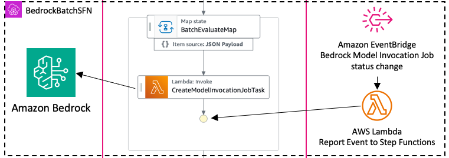

# BedrockBatchSfn

<!--BEGIN STABILITY BANNER-->

---


> All classes are under active development and subject to non-backward compatible changes or removal in any
> future version. These are not subject to the [Semantic Versioning](https://semver.org/) model.
> This means that while you may use them, you may need to update your source code when upgrading to a newer version of
> this package.

---

<!--END STABILITY BANNER-->

| **Language**                                                                                   | **Package**                             |
|:-----------------------------------------------------------------------------------------------|-----------------------------------------|
|  TypeScript | `@cdklabs/generative-ai-cdk-constructs` |
|  Python             | `cdklabs.generative_ai_cdk_constructs`  |

## Table of contents

- [Overview](#overview)
- [Usage](#usage)
- [Architecture](#architecture)
- [Cost](#cost)
- [Security](#security)
- [Supported AWS Regions](#supported-aws-regions)
- [Quotas](#quotas)
- [Clean up](#clean-up)

## Overview

The BedrockBatchSFN CDK construct simplifies the implementation of batch inference workflows with Amazon Bedrock by
providing a pattern for processing large volumes of data asynchronously. It helps developers
efficiently orchestrate batch processing tasks using Step Functions and Lambda, automatically handling job creation,
status monitoring, and result collection. The construct is particularly valuable for cost-sensitive workloads like bulk
text analysis, embeddings generation, and document summarization, taking advantage of Bedrock's 50% pricing discount for
batch operations. By abstracting away the complexity of managing asynchronous model invocations and state management,
developers can focus on their application logic while the construct handles the infrastructure and workflow
orchestration needed for reliable batch processing at scale.

## Usage

This construct implements
an [AWS Step Functions StateMachineFragment](https://docs.aws.amazon.com/cdk/api/v2/docs/aws-cdk-lib.aws_stepfunctions-readme.html#state-machine-fragments)
which can be used in your state machines to manage Bedrock batch inference jobs.

It requires Amazon Simple Storage Service(S3) buckets for input and output manifests and an AWS Identity and Access
Management(IAM) managed policy that allows inference. You can use a single bucket for both input and output. The policy
must have the following permissions for the models and inference profiles you plan to use:

- bedrock:InvokeModel
- bedrock:CreateModelInvocationJob

Here is a minimal deployable pattern definition:

```typescript fixture=default-bedrock-batch-stepfn
const batchBucket = new s3.Bucket(this, 'BedrockBatchBucket');

const batchPolicy = new iam.ManagedPolicy(this, 'BatchPolicy', {});

batchPolicy.addStatements(
  new iam.PolicyStatement({
    sid: 'Inference',
    actions: ['bedrock:InvokeModel', 'bedrock:CreateModelInvocationJob'],
    resources: [
      `arn:aws:bedrock:${this.region}::foundation-model/*`,
    ],
  }),
);

const bedrockBatchSfnFragment = new genaicdk.bedrock_batch_stepfn.BedrockBatchSfn(this, 'AwsBedrockBatchSfn', {
  bedrockBatchInputBucket: batchBucket,
  bedrockBatchOutputBucket: batchBucket,
  bedrockBatchPolicy: batchPolicy,
  timeout: cdk.Duration.hours(48),
});

const inputState = new sfn.Pass(this, 'InputState', {
  parameters: {
    job_name: 'test_job',
    manifest_keys: ['test_key.jsonl'],
    model_id: 'test.model-v1',
  },
});

const outputState = new sfn.Pass(this, 'OutputState');

const failState = new sfn.Fail(this, 'FailState', {
  causePath: sfn.JsonPath.stringAt('$.cause'),
  errorPath: sfn.JsonPath.stringAt('$.error'),
});

const chain = inputState
  .next(bedrockBatchSfnFragment)
  .next(outputState);

for (const endState of bedrockBatchSfnFragment.endStates) {
  if (endState instanceof sfn.TaskStateBase) {
    endState.addCatch(failState);
  }
}

const stateMachine = new sfn.StateMachine(this, 'StateMachine', {
  definitionBody: sfn.DefinitionBody.fromChainable(chain),
});
```

See the [API documentation](../../../../apidocs/classes/BedrockBatchSfn.md).

## Architecture



## Cost

Please note that you will be responsible for the costs associated with the AWS services used during the execution of
this construct. The cost of using this construct varies heavily according to model selection and the size of model
inference jobs. As a reference point, we will assume a workload that uses Amazon Nova Pro with 10,000 input tokens
and 1,000 output tokens per invocation, 100 records per invocation job and 300 invocation jobs per month.

We recommend creating a budget through [AWS Cost Explorer](http://aws.amazon.com/aws-cost-management/aws-cost-explorer/)
to help manage costs. Prices are subject to change. For full details, refer to the pricing webpage for each AWS service
used in this solution.

The following table provides a sample cost breakdown for deploying this solution with the default parameters in the **US
East (N. Virginia)** Region for **one month**.

| **AWS Service**               | **Dimensions**                                                                                                                                    | **Cost [USD]** |
|:------------------------------|:--------------------------------------------------------------------------------------------------------------------------------------------------|----------------|
| Amazon Bedrock                | Amazon Nova Pro with 10,000 input tokens and 1,000 output tokens per invocation, 100 records per invocation job and 300 invocation jobs per month | $168.00        |
| AWS Lambda                    | 6000 invocation requests, 128 MB, arm64 arch, 1 sec duration of each request                                                                      | $0.01          |
| AWS Step Functions            | 300 workflow requests with 1 state transition each                                                                                                | $0.00          |
| Amazon Simple Storage Service | Temporary Storage of Bedrock input and output manifests - 900 PUT requests, 600 GET requests, 1 GB data storage                                   | $0.03          |
| AWS CloudWatch                | < 1 GB logs ingested                                                                                                                              | $0.50          |
| **Total**                     |                                                                                                                                                   | **$168.54**    |

For comparison, with on-demand inference, the Amazon Bedrock usage would cost $336.00.

## Security

When you build systems on AWS infrastructure, security responsibilities are shared between you and AWS.
This [shared responsibility](http://aws.amazon.com/compliance/shared-responsibility-model/) model reduces your
operational burden because AWS operates, manages, and controls the components including the host operating system,
virtualization layer, and physical security of the facilities in which the services operate. For more information about
AWS security, visit [AWS Cloud Security](http://aws.amazon.com/security/).

## Supported AWS Regions

This solution uses the Amazon Bedrock service, which is not currently available in all AWS Regions. You must
launch this construct in an AWS Region where these services are available. For the most current availability of AWS
services by Region, see
the [AWS Regional Services List](https://aws.amazon.com/about-aws/global-infrastructure/regional-product-services/).

> **Note**
> You need to explicity enable access to models before they are available for use in the Amazon Bedrock service. Please
> follow the [Amazon Bedrock User Guide](https://docs.aws.amazon.com/bedrock/latest/userguide/model-access.html) for
> steps
> related to enabling model access.

## Quotas

Service quotas, also referred to as limits, are the maximum number of service resources or operations for your AWS
account.

Make sure you have sufficient quota for each of the services implemented in this solution. For more information, refer
to [AWS service quotas](https://docs.aws.amazon.com/general/latest/gr/aws_service_limits.html).

To view the service quotas for all AWS services in the documentation without switching pages, view the information in
the [Service endpoints and quotas](https://docs.aws.amazon.com/general/latest/gr/aws-general.pdf#aws-service-information)
page in the PDF instead.

## Clean up

When deleting your stack which uses this construct, do not forget to go over the following instructions to avoid
unexpected charges:

- delete all the associated logs created by the different services in Amazon CloudWatch logs

---

&copy; Copyright Amazon.com, Inc. or its affiliates. All Rights Reserved.