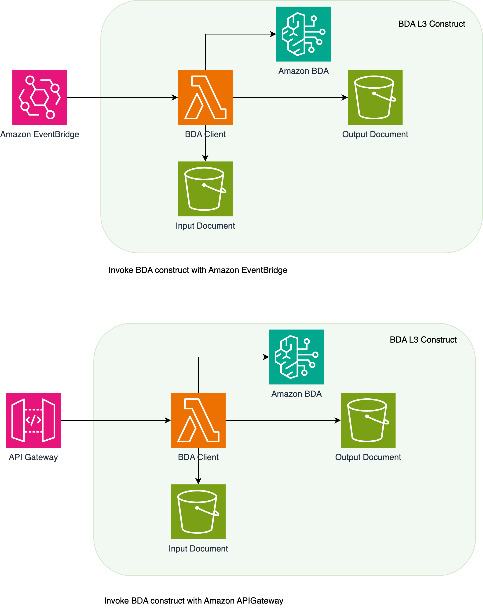

# aws-bedrock-data-automation

<!--BEGIN STABILITY BANNER-->

---


> All classes are under active development and subject to non-backward compatible changes or removal in any
> future version. These are not subject to the [Semantic Versioning](https://semver.org/) model.
> This means that while you may use them, you may need to update your source code when upgrading to a newer version of this package.

---

<!--END STABILITY BANNER-->


| **Language**                                                                                   | **Package**                             |
| :----------------------------------------------------------------------------------------------- | ----------------------------------------- |
|  TypeScript | `@cdklabs/generative-ai-cdk-constructs` |
|  Python             | `cdklabs.generative_ai_cdk_constructs`  |
|  Java                   | `io.github.cdklabs.generative_ai_cdk_constructs`|
|  .Net                   | `CdkLabs.GenerativeAICdkConstructs`|
|  Go                   | `github.com/cdklabs/generative-ai-cdk-constructs-go/generative-ai-cdk-constructs`|

## Table of contents

  - [Overview](#overview)
  - [Architecture](#architecture)
  - [Key Features](#keyfeatures)
  - [Pattern Construct Props](#pattern-construct-props)
  - [Initializer](#initializer)
  - [Pattern Properties](#pattern-properties)
  - [Methods](#methods)
  - [Default properties](#default-properties)
  - [Cost](#cost)
  - [Security](#security)
  - [Supported AWS Regions](#supported-aws-regions)
  - [Quotas](#quotas)


## Overview

The Amazon Bedrock Data Automation construct simplifies the process of extracting insights from unstructured multimodal content (documents, images, video, and audio) using Amazon Bedrock Data Automation. It provides a complete infrastructure setup with Lambda functions for managing the entire workflow - from creating custom blueprints and projects to handling data processing automation and monitoring task status. The construct automates the deployment of necessary AWS resources and configures the required IAM permissions, making it easier for developers to build and manage intelligent document processing, media analysis, and other multimodal data-centric automation solutions.

## Architecture

The AWS Bedrock Data Automation Construct implements a serverless solution that enables automated data processing using Amazon Bedrock. The construct deploys an AWS Lambda function that serves as a data automation client, capable of interacting with Amazon Simple Storage Service (Amazon S3) for input and output operations, and invoking the Amazon Bedrock Data Processing API.

This construct can be integrated with Amazon API Gateway for synchronous REST API operations or Amazon EventBridge for event-driven processing. The Lambda function is configured to handle incoming requests from both services, allowing flexibility in implementation patterns. The solution supports both API-based and event-driven architectures, enabling you to process data through Amazon Bedrock based on HTTP requests or scheduled/triggered events. 




## Pattern Construct Props

| Name | Type | Required | Description |
|------|------|----------|-------------|
| inputBucketName | string | No | Name of the S3 bucket for uploading blueprint schema file. If not provided, a new bucket will be created. |
| isCustomBDABlueprintRequired | boolean | No | Flag to indicate if custom Bedrock Data Automation blueprint creation is required. |
| isBDAProjectRequired | boolean | No | Flag to indicate if Bedrock Data Automation project creation is required. |
| isBDAInvocationRequired | boolean | No | Flag to indicate if Bedrock Data Automation invocation functionality is required. |
| isStatusRequired | boolean | No | Flag to indicate if status checking functionality is required. |
| outputBucketName | string | No | Name of the S3 bucket for storing output files. If not provided, a new bucket will be created when isBDAInvocationRequired is true. |
| outputFilename | string | No | Name of the output file for processed data. |


## Initializer

TypeScript:
```typescript
import { BedrockDataAutomation } from 'generative-ai-cdk-constructs';

const bdaConstruct = new BedrockDataAutomation(this, 'MyBDAConstruct', {
  inputBucketName: 'XXXXXXXXXXXXXXX',
  outputBucketName: 'XXXXXXXXXXXXXXXX',
  isCustomBDABlueprintRequired: true,
  isBDAProjectRequired: true,
  isBDAInvocationRequired: true,
  isStatusRequired: true
});


```

```python
from generative_ai_cdk_constructs import BedrockDataAutomation

bda_construct = BedrockDataAutomation(self, "MyBDAConstruct",
    input_bucket_name="XXXXXXXXXXXXXXX",
    output_bucket_name="XXXXXXXXXXXXXXXX",
    is_custom_bda_blueprint_required=True,
    is_bda_project_required=True,
    is_bda_invocation_required=True,
    is_status_required=True
)


                    
```

## Key Features

This construct provides granular control over Amazon Bedrock Data Automation capabilities through configurable feature flags. You can selectively enable specific features based on your workload requirements.

### Creating Custom Blueprints

The construct supports creation of custom blueprints for data processing automation through an EventBridge-triggered Lambda function. To enable this functionality, set `isCustomBDABlueprintRequired = true` in the construct props.

### Blueprint Creation Event Format

To create a new blueprint, either send an event to EventBridge or an API Gateway with following options:

## Option1:  Add Amazon EventBridge as a front-end interface to the construct

Typescript

```typescript
import { EventbridgeToLambda } from '@aws-solutions-constructs/aws-eventbridge-lambda';

    const bluePrintFunction = bdaConstruct.blueprintLambdaFunction
    const blueprintEventbridge = new EventbridgeToLambda(this, 'CreateBlueprintEventRule', {
      existingLambdaObj: bluePrintFunction,
      eventRuleProps: {
        eventPattern: {
          source: ['custom.bedrock.blueprint'],
          detailType: ['Bedrock Blueprint Request'],
        }
      },
    });

```
Python 

```python
EventbridgeToLambda(self, 'create_blueprint-lambda',
                    existing_lambda_obj=bda_construct
                    event_rule_props= {
                    event_pattern= {
                    source= ['custom.bedrock.blueprint'],
                    detail_type= ['Bedrock Blueprint Request'],
                    }
                    }
                    )
```


upload the sample file to s3

```
aws s3 cp ./{sample_file.pdf} s3://{input-bucket-name}/
```

Create a bp_event.json file using above event and then use following cli command to push the event.
```
aws events put-events --cli-input-json file://bp_event.json
```
```json
{
    "Entries": [
        {
            "Source": "custom.bedrock.blueprint",
            "DetailType": "Bedrock Blueprint Request",
            "Detail": {
                "blueprint_name": "noa_bp",
                "blueprint_type": "DOCUMENT",
                "blueprint_stage": "LIVE",
                "operation": "CREATE",
                "schema_fields": [ // This is a sample schema, replace this with your expected blueprint schema.
                    {
                        "name": "Total income",
                        "description": "Please analyze the following Notice of assesment report and extract information about Total income.",
                        "alias": "Total income"
                    },
                    {
                        "name": "Taxable Income", 
                        "description": "Please analyze the following Notice of assesment report and extract information about Taxable income.",
                        "alias": "Taxable Income"
                    },
                    {
                        "name": "Tax payable",
                        "description": "Please analyze the following Notice of assesment report and extract information about Tax payable.",
                        "alias": "Tax payable"
                    }
                ]
            }
                    }
    ]
}
```    

## Option2:  Add API Gateway as a front-end interface to the construct

```typescript
import { ApiGatewayToLambda } from '@aws-solutions-constructs/aws-apigateway-lambda';

new ApiGatewayToLambda(this, 'ApiGatewayToLambdaPattern', {
      existingLambdaObj:bluePrintFunction,
      apiGatewayProps:{
        restApiName: 'createCustomBlueprint',
      }
    });
```

Publish a POST request with following body
```json 

             {
             "blueprint_name":"noa_bp_api_2",
             "blueprint_type":"DOCUMENT",
             "blueprint_stage":"LIVE",
             "operation":"CREATE",
             "schema_fields":[
             {
                "name":"Total income",
                "description":"Please analyze the following Notice of assesment report and extract information about Total income.",
                "alias":"Total income"
                },
             {
                "name":"Taxable Income",
                "description":"Please analyze the following Notice of assesment report and extract information about Taxable income.",
                "alias":"Taxable Income"
                },
             {
                "name":"Tax payable",
                "description":"Please analyze the following Notice of assesment report and extract information about Tax payable.",
                "alias":"Tax payable"
                 
             }
             ]
        }
```

## Delete blueprint
```json

{
    "Entries": [
        {
            "Source": "custom.bedrock.blueprint",
            "DetailType": "Bedrock Blueprint Request",
            "Detail": {
                "blueprint_arn": "XXXXXXXXX",
                "operation": "DELETE",
                
            }
                    }
    ]
}
```

## Get blueprint Post request

```json
{
             "operation":"get","blueprintArn":"XXXXXXXX",
}
```
## Update blueprint Post request

```json
{
             "operation":"delete","blueprintArn":"XXXXXXXX",
}

```

## Delete blueprint Post request

```json
{
             "operation":"delete","blueprintArn":"XXXXXXXX",
}
```


## Creating Data Automation Projects

The construct enables creation and management of Bedrock Data Automation projects through an EventBridge-triggered Lambda function. To enable this functionality, set `isBDAProjectRequired = true` in the construct props.

### Project Creation Event Format

To create a new bedrock data automation project, either send an event to EventBridge or an API Gateway with following options:

## Option1:  Add Amazon EventBridge as a front-end interface to the construct

Typescript

```typescript
import { EventbridgeToLambda } from '@aws-solutions-constructs/aws-eventbridge-lambda';

    const bdaProjectFunction = bdaConstruct.bdaProjectLambdaFunction
    const blueprintEventbridge = new EventbridgeToLambda(this, 'bdaProject', {
      existingLambdaObj: bdaProjectFunction,
      eventRuleProps: {
        eventPattern: {
          source: ['custom.bedrock.blueprint'],
          detailType: ['Bedrock Project Request'],
        }
      },
    });

```
Python 

```python
EventbridgeToLambda(self, 'create_blueprint-lambda',
                    existing_lambda_obj=bdaProjectFunction
                    event_rule_props= {
                    event_pattern= {
                    source= ['custom.bedrock.blueprint'],
                    detail_type= ['Bedrock Project Request'],
                    }
                    }
                    )
```
Create a bda_event.json file using above event and then use following cli command to push the event.
```
aws events put-events --cli-input-json file://bda_event.json
```

```json
{
    "Entries": [
        {
            "Source": "custom.bedrock.project",
            "DetailType": "Bedrock Project Request",
            "Detail": {
                "project_name": "sample_proj",
                "project_description": "Sample Project",
                "project_stage": "LIVE",
                "operation": "CREATE"
            }
        }
    ]
}
```
## Option2:  Add API Gateway as a front-end interface to the construct

```typescript
import { ApiGatewayToLambda } from '@aws-solutions-constructs/aws-apigateway-lambda';

new ApiGatewayToLambda(this, 'ApiGatewayToLambdaPattern', {
      existingLambdaObj:bluePrintFunction,
      apiGatewayProps:{
        restApiName: 'createCustomBlueprint',
      }
    });
```

Publish a POST request with following body
```json 

   {
             "operation":"create","projectName":"bp_project_1","projectStage":"LIVE","projectDescription":"sample","customOutputConfiguration":
             {"blueprints":[{"blueprintArn":"XXXXXXXX","blueprintStage":"LIVE"}]}

  
}
```

## Delete project
```json
{
             "operation":"delete","projectArn":"XXXXXXXX",
}
```

## Data Processing Invocations

The construct enables automated data processing through Bedrock Data Automation invocations. To enable this functionality, set `isBDAInvocationRequired = true` in the construct props.

To invoke data processing, either send an event to EventBridge or an API Gateway with following options:

## Option1:  Add Amazon EventBridge as a front-end interface to the construct

Typescript

```typescript
import { EventbridgeToLambda } from '@aws-solutions-constructs/aws-eventbridge-lambda';

    const dataProcessingFunction = bdaConstruct.bdaInvocationLambdaFunction
    
    new dataProcessingFunction(this, 'bdainvocation', {
      existingLambdaObj: dataProcessingFunction,
      eventRuleProps: {
        eventPattern: {
          source: ['custom.bedrock.blueprint'],
          detailType: ['Bedrock Invoke Request'],
        }
      },
    });

```
Python 

```python
EventbridgeToLambda(self, 'data_pricessing-lambda',
                    existing_lambda_obj=dataProcessingFunction
                    event_rule_props= {
                    event_pattern= {
                    source= ['custom.bedrock.blueprint'],
                    detail_type= ['Bedrock Invoke Request'],
                    }
                    }
                    )
```
Create a bda_event.json file using above event and then use following cli command to push the event.
```
aws events put-events --cli-input-json file://bda_event.json
```
blueprint_arn is fetched from create bluepreint response.

```json
{
    "Entries": [
        {
            "Source": "custom.bedrock.invocation",
            "DetailType": "Bedrock Invoke Request",
            "Detail": {
                "input_filename": "sample_input.pdf",
                "output_filename": "sample_output.json",
                "blueprints": [{
                    "blueprint_arn":"XXXXXXX",
                    "stage":"LIVE"
                }],
            }
        }
    ]
}
```
## Option2:  Add API Gateway as a front-end interface to the construct

```typescript
import { ApiGatewayToLambda } from '@aws-solutions-constructs/aws-apigateway-lambda';

new ApiGatewayToLambda(this, 'ApiGatewayToLambdaPattern', {
      existingLambdaObj:bdaInvocationLambdaFunction,
      apiGatewayProps:{
        restApiName: 'invokeDataProcessing',
      }
    });
```

Publish a POST request with following body
```json 

             {
             "input_filename": "sample_input.pdf",
                "output_filename": "sample_output.json",
                "blueprints": [{
                    "blueprint_arn":"XXXXXXX",
                    "stage":"LIVE"
                }],
        }
```


## Processing Status Monitoring

The construct provides automated status monitoring for Bedrock Data Automation processing jobs. To enable this functionality, set `isStatusRequired = true` in the construct props.

### Status Check Event Format

To check the status of a processing job,either send an event to EventBridge or an API Gateway with following options:

## Option1:  Add Amazon EventBridge as a front-end interface to the construct

Typescript

```typescript
import { EventbridgeToLambda } from '@aws-solutions-constructs/aws-eventbridge-lambda';

    const dataResultStatusFunction = bdaConstruct.bdaResultStatuLambdaFunction
    
    new dataProcessingFunction(this, 'bdaResult', {
      existingLambdaObj: dataResultStatusFunction,
      eventRuleProps: {
        eventPattern: {
          source: ['custom.bedrock.blueprint'],
          detailType: ['Bedrock Result Status'],
        }
      },
    });

```
Python 

```python
EventbridgeToLambda(self, 'data_result_lambda',
                    existing_lambda_obj=dataResultStatusFunction
                    event_rule_props= {
                    event_pattern= {
                    source= ['custom.bedrock.blueprint'],
                    detail_type= ['Bedrock Result Status'],
                    }
                    }
                    )
```
Create a bda_result_event.json file using above event and then use following cli command to push the event.
```
aws events put-events --cli-input-json file://bda_result_event.json
```
invocation_arn is fetched from data processing started job.

```json
{
    "Entries": [
        {
            "Source": "custom.bedrock.blueprint",
            "DetailType": "Bedrock Result Status",
            "Detail": {"invocation_arn":"XXXXXX"}
        }
    ]
}

```
## Option2:  Add API Gateway as a front-end interface to the construct

```typescript
import { ApiGatewayToLambda } from '@aws-solutions-constructs/aws-apigateway-lambda';

new ApiGatewayToLambda(this, 'ApiGatewayToLambdaPattern', {
      existingLambdaObj:dataResultStatusFunction,
      apiGatewayProps:{
        restApiName: 'dataResultStatus',
      }
    });
```

Publish a POST request with following body.
invocation_arn is fetched from data processing API response
```json 

     {"invocation_arn":"XXXXXX"}
```


## Cost

You are responsible for the cost of the AWS services used while running this construct.

We recommend creating a budget through [AWS Cost Explorer](http://aws.amazon.com/aws-cost-management/aws-cost-explorer/) to help manage costs. Prices are subject to change. For full details, refer to the pricing webpage for each AWS service used in this solution:

- [AWS Lambda pricing](https://aws.amazon.com/lambda/pricing/)
- [Amazon CloudWatch pricing](https://aws.amazon.com/cloudwatch/pricing/)
- [Amazon Bedrock pricing](https://aws.amazon.com/bedrock/pricing/)

## Supported AWS Regions

Amazon Bedrock Data Automation is currently available only in US West (Oregon) Region - `us-west-2`. When deploying this construct, ensure your AWS CDK application is configured to deploy in the US West (Oregon) Region. If you attempt to deploy this construct in any other region, it will fail as the underlying Amazon Bedrock Data Automation service is not available. This regional limitation applies to all components of the construct, including blueprint creation, project management, data processing invocations, and status monitoring functionalities. We recommend monitoring the AWS Regional Services List for updates on regional availability expansions.

Note: While the construct must be deployed in US West (Oregon), you can still process data stored in S3 buckets from other regions, though this may incur additional cross-region data transfer costs.


## Security

When you build systems on AWS infrastructure, security responsibilities are shared between you and AWS. This [shared responsibility](http://aws.amazon.com/compliance/shared-responsibility-model/) model reduces your operational burden because AWS operates, manages, and controls the components including the host operating system, virtualization layer, and physical security of the facilities in which the services operate. For more information about AWS security, visit [AWS Cloud Security](http://aws.amazon.com/security/).

Optionnaly, you can provide existing resources to the constructs (marked optional in the construct pattern props). If you chose to do so, please refer to the official documentation on best practices to secure each service:

- [Amazon CloudWatch](https://docs.aws.amazon.com/AmazonCloudWatch/latest/monitoring/security.html)

If you grant access to a user to your account where this construct is deployed, this user may access information stored by the construct (Amazon CloudWatch logs). To help secure your AWS resources, please follow the best practices for [AWS Identity and Access Management (IAM)](https://docs.aws.amazon.com/IAM/latest/UserGuide/best-practices.html).

AWS CloudTrail provides a number of security features to consider as you develop and implement your own security policies. Please follow the related best practices through the [official documentation](https://docs.aws.amazon.com/awscloudtrail/latest/userguide/best-practices-security.html).


## Quotas

Service quotas, also referred to as limits, are the maximum number of service resources or operations for your AWS account.

Make sure you have sufficient quota for each of the services implemented in this solution. For more information, refer to [AWS service quotas](https://docs.aws.amazon.com/general/latest/gr/aws_service_limits.html).

To view the service quotas for all AWS services in the documentation without switching pages, view the information in the [Service endpoints and quotas](https://docs.aws.amazon.com/general/latest/gr/aws-general.pdf#aws-service-information) page in the PDF instead.

---

&copy; Copyright Amazon.com, Inc. or its affiliates. All Rights Reserved.
