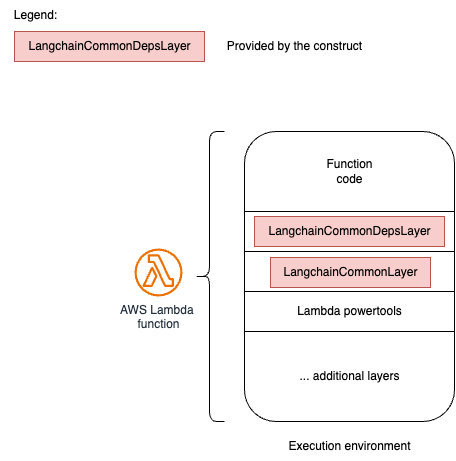

# aws-langchain-common-layer
<!--BEGIN STABILITY BANNER-->

---


> All classes are under active development and subject to non-backward compatible changes or removal in any
> future version. These are not subject to the [Semantic Versioning](https://semver.org/) model.
> This means that while you may use them, you may need to update your source code when upgrading to a newer version of this package.

---
<!--END STABILITY BANNER-->

| **Language**     | **Package**        |
|:-------------|-----------------|
| Typescript|`@awslabs/@emerging_tech_cdk_constructs`|

## Table of contents

- [Credits](#credits)
- [Overview](#overview)
- [Initializer](#initializer)
- [Pattern Construct Props](#pattern-construct-props)
- [Pattern Properties](#pattern-properties)
- [Default properties](#default-properties)
- [Troubleshooting](#troubleshooting)
- [Architecture](#architecture)
- [Cost](#cost)
- [Security](#security)
- [Supported AWS Regions](#supported-aws-regions)
- [Quotas](#quotas)

## Credits

This construct is a modified version of the following construct: https://github.com/aws-samples/aws-genai-llm-chatbot/tree/main/lib/model-interfaces/langchain 

Thanks to the original authors: 
- [Bigad Soleiman](https://www.linkedin.com/in/bigadsoleiman/)
- [Sergey Pugachev](https://www.linkedin.com/in/spugachev/)

## Overview

This construct provides two AWS Lambda layers:
- one dependency layer which contains needed python pip packages to build Generative AI applications based on the [Langchain](https://python.langchain.com/docs/get_started/introduction) client. The list of libraries installed and their version is available [here](../../../../layers/langchain-common-deps/requirements.txt)
- one Python code layer which contains helper functions to accelerate development of Generative AI applications on AWS based on the [Langchain](https://python.langchain.com/docs/get_started/introduction) client.

This construct has a dependency on [Lambda Power Tools](https://github.com/aws-powertools/powertools-lambda-python).

Here is a minimal deployable pattern definition:

Typescript
``` typescript
import { Construct } from 'constructs';
import { Stack, StackProps, Aws } from 'aws-cdk-lib';
import { LangchainCommonDepsLayer, LangchainCommonLayer } from '@awslabs/generative-ai-cdk-constructs';

const lambdaArchitecture = lambda.Architecture.ARM_64;
const lambdaRuntime = lambda.Runtime.PYTHON_3_10;

// This is one way of getting a lambda powertools layer
const powerToolsArn =
        lambdaArchitecture === lambda.Architecture.X86_64
          ? `arn:aws:lambda:${cdk.Aws.REGION}:017000801446:layer:AWSLambdaPowertoolsPythonV2:42`
          : `arn:aws:lambda:${cdk.Aws.REGION}:017000801446:layer:AWSLambdaPowertoolsPythonV2-Arm64:42`;

const lambdaDepsLayer = new emergingTech.LangchainCommonDepsLayer(this, 'lambdagenaidepslayer', {
        runtime: lambdaRuntime,
        architecture: lambdaArchitecture,
        autoUpgrade: true
      });

const lambdaCommonLayer = new emergingTech.LangchainCommonLayer(this, 'lambdagenaicommonlayer', {
runtime: lambdaRuntime,
architecture: lambdaArchitecture,
});

//Then pass the layers above to your lambda function constructor
```

## Initializer

```
new LangchainCommonDepsLayer(scope: Construct, id: string, props: LangchainLayerProps)
```

```
new LangchainCommonLayer(scope: Construct, id: string, props: LangchainLayerProps)
```

Parameters

- scope [Construct](https://docs.aws.amazon.com/cdk/api/v2/docs/constructs.Construct.html)
- id string
- props LangchainLayerProps

## Pattern Construct Props

| **Name**     | **Type**        | **Required** |**Description** |
|:-------------|:----------------|-----------------|-----------------|
| runtime | [lambda.Runtime](https://docs.aws.amazon.com/cdk/api/v2/docs/aws-cdk-lib.aws_lambda.Runtime.html) |  | Lambda function runtime compatible with this Layer. |
| architecture | [lambda.Architecture](https://docs.aws.amazon.com/cdk/api/v2/docs/aws-cdk-lib.aws_lambda.Architecture.html)|  | Lambda function architecture compatible with this Layer. |
| autoUpgrade | boolean |  | Add '--upgrade' to pip install requirements.txt. In case of a LangchainCommonLayer, this parameter is not used. |

## Pattern Properties

| **Name**     | **Type**        | **Description** |
|:-------------|:----------------|-----------------|
| layer | [lambda.LayerVersion](https://docs.aws.amazon.com/cdk/api/v2/docs/aws-cdk-lib.aws_lambda.LayerVersion.html) | The instance of lambda.LayerVersion created by the construct |

## Default properties

Out of the box implementation of the Construct without any override will not set any default values. Depending on the features enabled, user will need to provide environmental variable values to the AWS Lambda function used by the LangchainCommonLayer. For the available 

## Python utility layer (LangchainCommonLayer)

This utility layer provides helper functions to accelerate the development of Generative AI applications on AWS. 

| **Provider** | **Prediction (waiting)** | **Streaming** |
|:-------------|:----------------|-----------------|
| OpenAI | ✅ | ✅  |
| Sagemaker | ✅ | ❌ |
| Amazon Bedrock | ✅ | ✅  |

### Registry

The model registry is a catalog, statically initialized, providing the list of supported models by the library. 

Available models in the registry:

| **Provider** | **Model** |
|:-------------|:----------------|
| OpenAI | All |
| Sagemaker | FalconLite, Llama2 |
| Amazon Bedrock | All |

### Adapters

Adapters provide a generic interface to call models from different providers using the same input/output format. Adapters will correctly configure the client (boto3, openai,...) and provide the glue code to correctly serialize/deserialize requests (input/output consistency). 

```
from genai_core.adapters.registry import registry

adapter = registry.get_adapter(f"{provider}.{model_id}")

model = adapter(
        model_id=model_id,
        session_id=session_id,
        user_id=user_id,
        model_kwargs=model_kwargs,
        adapter_kwargs=adapter_args
    )

response = model.run(
        prompt=prompt,
        tools=[],
    )
```


## Troubleshooting

| **Error Code**     | **Message**        | **Description** |**Fix** |
|:-------------|:----------------|-----------------|-----------------|
| 601 | <llm_name> Exception during prediction | An exception happened while the Langchain client was running a prediction with the selected LLM | Verify logs to get the proper error message from the Langchain client |

## Architecture


## Cost

You are responsible for the cost of the AWS services used while running this construct. As of this revision, the cost for running this construct with the default settings in the US East (N. Virginia) Region is approximately $X per month.

We recommend creating a budget through [AWS Cost Explorer](http://aws.amazon.com/aws-cost-management/aws-cost-explorer/) to help manage costs. Prices are subject to change. For full details, refer to the pricing webpage for each AWS service used in this solution.

The following table provides a sample cost breakdown for deploying this solution with the default parameters in the **US East (N. Virginia)** Region for **one month**.


| **AWS Service**     | **Dimensions**        | **Cost [USD]** |
|:-------------|:----------------|-----------------|
| AWS Lambda | |  |
| Total Deployment cost | | |

> **Note**
> The costs of API calls to third-party LLM providers are not included in these estimates. See the pricing guide of your LLM provider.

## Security

When you build systems on AWS infrastructure, security responsibilities are shared between you and AWS. This [shared responsibility](http://aws.amazon.com/compliance/shared-responsibility-model/) model reduces your operational burden because AWS operates, manages, and controls the components including the host operating system, virtualization layer, and physical security of the facilities in which the services operate. For more information about AWS security, visit [AWS Cloud Security](http://aws.amazon.com/security/).

If choosing to interface with a third-party LLM provider (outside of Amazon Bedrock), customers must evaluate the security considerations of data leaving their AWS account. The customer is required to provide a valid API key at the time of deployment.

The primary piece of data sent to the third-party LLM provider is the prompt to perform inference on. Depending on the use case, the prompt can contain the user’s input, previous interactions (for example, chat history), and document excerpts sourced from the configured knowledge base (for example, Amazon OpenSearch search result).

> **Warning**
> This construct allows you to interact with models from third party providers. Your use of the third-party Generative AI models is governed by the terms provided to you by the third-party GAI model providers when you acquired your license to use them (for example, their terms of service, license agreement, acceptable use policy, and privacy policy).
>
>You are responsible for ensuring that your use of the third-party GAI models comply with the terms governing them, and any laws, rules, regulations, policies, or standards that apply to you.
>
>You are also responsible for making your own independent assessment of the third-party GAI models that you use, including their outputs and how third-party GAI model providers use any data that might be transmitted to them based on your deployment configuration. AWS does not make any representations, warranties, or guarantees regarding the third-party GAI models, which are “Third-Party Content” under your agreement with AWS. This construct is offered to you as “AWS Content” under your agreement with AWS.

## Supported AWS Regions

This solution optionally uses the Amazon Bedrock and Amazon OpenSearch service, which is not currently available in all AWS Regions. You must launch this construct in an AWS Region where these services are available. For the most current availability of AWS services by Region, see the [AWS Regional Services List](https://aws.amazon.com/about-aws/global-infrastructure/regional-product-services/).

> **Note**
>You need to explicity enable access to models before they are available for use in the Amazon Bedrock service. Please follow the [Amazon Bedrock User Guide](https://docs.aws.amazon.com/bedrock/latest/userguide/model-access.html) for steps related to enabling model access.

## Quotas

Service quotas, also referred to as limits, are the maximum number of service resources or operations for your AWS account.

Make sure you have sufficient quota for each of the services implemented in this solution. For more information, refer to [AWS service quotas](https://docs.aws.amazon.com/general/latest/gr/aws_service_limits.html).

To view the service quotas for all AWS services in the documentation without switching pages, view the information in the [Service endpoints and quotas](https://docs.aws.amazon.com/general/latest/gr/aws-general.pdf#aws-service-information) page in the PDF instead.

***
&copy; Copyright Amazon.com, Inc. or its affiliates. All Rights Reserved.