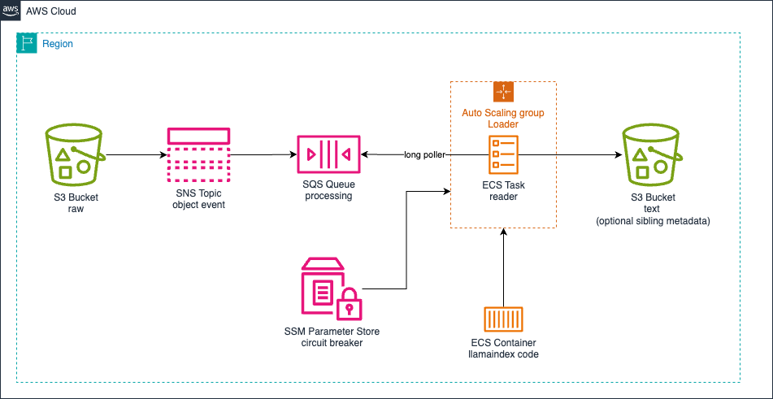

# aws-llama-index-data-loader

<!--BEGIN STABILITY BANNER-->

---


> All classes are under active development and subject to non-backward compatible changes or removal in any
> future version. These are not subject to the [Semantic Versioning](https://semver.org/) model.
> This means that while you may use them, you may need to update your source code when upgrading to a newer version of this package.

---

<!--END STABILITY BANNER-->

## Table of contents

- [aws-llama-index-data-loader](#aws-llama-index-data-loader)
  - [Table of contents](#table-of-contents)
  - [Credits](#credits)
  - [Overview](#overview)
  - [Initializer](#initializer)
  - [Pattern Construct Props](#pattern-construct-props)
  - [Pattern Properties](#pattern-properties)
  - [Methods](#methods)
  - [Default properties](#default-properties)
  - [Architecture](#architecture)
  - [Cost](#cost)
  - [Security](#security)
  - [Supported AWS Regions](#supported-aws-regions)
  - [Quotas](#quotas)

## Credits

Thanks to @jtlew for the initial insight for the need on this construct.

## Overview

This construct provides a Amazon Elastic Cluster Service using Llamaindex Data Loaders with default properties [here](#default-properties).

Here is a minimal deployable pattern definition:

TypeScript

```typescript
import { Construct } from 'constructs';
import { Stack, StackProps, Aws } from 'aws-cdk-lib';
import { LlamaIndexDataLoader } from '@cdklabs/generative-ai-cdk-constructs';

const dataLoader = new LlamaIndexDataLoader(this, 'LlamaIndexDataLoader', {});
```

Python

```python
from constructs import Construct
from cdklabs.generative_ai_cdk_constructs import LlamaIndexDataLoader

data_loader = LlamaIndexDataLoader(self, 'LlamaIndexDataLoader', )
```

## Initializer

```
new LlamaIndexDataLoader(scope: Construct, id: string, props: LlamaIndexDataLoaderProps)
```

Parameters

- scope [Construct](https://docs.aws.amazon.com/cdk/api/v2/docs/constructs.Construct.html)
- id string
- props LlamaIndexDataLoaderProps

## Pattern Construct Props


| **Name**                               | **Type**                                                                                                                                               | **Required**                                              | **Description**                                                                                                                                                                                                                                                                                                                                                                                               |
| :--------------------------------------- | :------------------------------------------------------------------------------------------------------------------------------------------------------- | ----------------------------------------------------------- | --------------------------------------------------------------------------------------------------------------------------------------------------------------------------------------------------------------------------------------------------------------------------------------------------------------------------------------------------------------------------------------------------------------- |
| existingDashboard               | [aws_cloudwatch.Dashboard](https://docs.aws.amazon.com/cdk/api/v2/docs/aws-cdk-lib.aws_cloudwatch.Dashboard.html)                                |  | Existing dashboard to be used by the construct. **Mutually exclusive** with ```dashboardName``` - only one should be specified.                                                                                                                                                                                                                                                           |
| dashboardName | string |  | A name for the dashboard which will be created. If not provided, the construct will create a new dashboard named 'AossMetricsDashboard'. **Mutually exclusive** with ```existingDashboard``` - only one should be specified.                                                                                                                                                                                                                                                            |

## Pattern Properties

| **Name**                     | **Type**                                                                                                                  | **Description**                                                                                                                                                                |
| :----------------------------- | :-------------------------------------------------------------------------------------------------------------------------- | -------------------------------------------------------------------------------------------------------------------------------------------------------------------------------- |
| dashboard                          | [aws_cloudwatch.Dashboard](https://docs.aws.amazon.com/cdk/api/v2/docs/aws-cdk-lib.aws_cloudwatch.Dashboard.html)                                     | The CloudWatch Dashboard used by the construct (whether created by the construct or provided by the client)                                                                                     |

## Methods

N/A

## Default properties

Out-of-the-box implementation of the construct without any override will set the following defaults:

### Memory

TBD

## Architecture



## Cost

You are responsible for the cost of the AWS services used while running this construct.

We recommend creating a budget through [AWS Cost Explorer](http://aws.amazon.com/aws-cost-management/aws-cost-explorer/) to help manage costs. Prices are subject to change. For full details, refer to the pricing webpage for each AWS service used in this solution:

## Security

When you build systems on AWS infrastructure, security responsibilities are shared between you and AWS. This [shared responsibility](http://aws.amazon.com/compliance/shared-responsibility-model/) model reduces your operational burden because AWS operates, manages, and controls the components including the host operating system, virtualization layer, and physical security of the facilities in which the services operate. For more information about AWS security, visit [AWS Cloud Security](http://aws.amazon.com/security/).

Optionnaly, you can provide existing resources to the constructs (marked optional in the construct pattern props). If you chose to do so, please refer to the official documentation on best practices to secure each service:

- TBD


## Supported AWS Regions

This solution depends uses the Amazon OpenSearch Serverless and Amazon CloudWatch services, which are not currently available in all AWS Regions. You must launch this construct in an AWS Region where these services are available. For the most current availability of AWS services by Region, see the [AWS Regional Services List](https://aws.amazon.com/about-aws/global-infrastructure/regional-product-services/).

## Quotas

Service quotas, also referred to as limits, are the maximum number of service resources or operations for your AWS account.

Make sure you have sufficient quota for each of the services implemented in this solution. For more information, refer to [AWS service quotas](https://docs.aws.amazon.com/general/latest/gr/aws_service_limits.html).

To view the service quotas for all AWS services in the documentation without switching pages, view the information in the [Service endpoints and quotas](https://docs.aws.amazon.com/general/latest/gr/aws-general.pdf#aws-service-information) page in the PDF instead.

---

&copy; Copyright Amazon.com, Inc. or its affiliates. All Rights Reserved.
