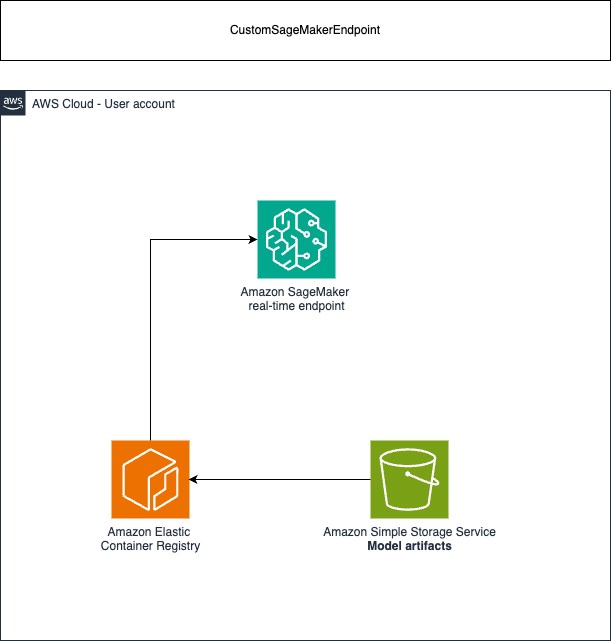
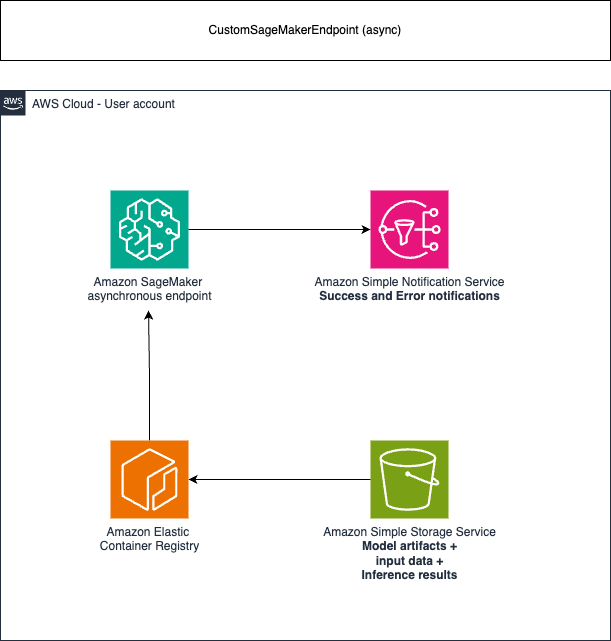

# aws-model-deployment-sagemaker (CustomSageMakerEndpoint)

<!--BEGIN STABILITY BANNER-->

---


> All classes are under active development and subject to non-backward compatible changes or removal in any
> future version. These are not subject to the [Semantic Versioning](https://semver.org/) model.
> This means that while you may use them, you may need to update your source code when upgrading to a newer version of this package.

---
<!--END STABILITY BANNER-->

| **Language**     | **Package**        |
|:-------------|-----------------|
| TypeScript|`@cdklabs/generative-ai-cdk-constructs`|
| Python|`cdklabs.generative_ai_cdk_constructs`|

## Table of contents

- [Overview](#overview)
- [Initializer](#initializer)
- [Pattern Construct Props](#pattern-construct-props)
- [Pattern Properties](#pattern-properties)
- [Default properties](#default-properties)
- [Troubleshooting](#troubleshooting)
- [Architecture](#architecture)
- [Cost](#cost)
- [Security](#security)
- [Supported AWS Regions](#supported-aws-regions)
- [Quotas](#quotas)
- [Clean up](#clean-up)

## Overview

This construct is provided here to simplify the deployment of foundation models on Amazon SageMaker.

This construct only work when region of the stack is specified explicitly:
```
env: {
    region: 'eu-west-1',
},
```

Here is a minimal deployable pattern definition to deploy a real-time Amazon SageMaker endpoint:

TypeScript
```typescript

import { Construct } from 'constructs';
import { Stack, StackProps, Aws } from 'aws-cdk-lib';
import { CustomSageMakerEndpoint, DeepLearningContainerImage } from '@cdklabs/generative-ai-cdk-constructs';

// Need an existing bucket containing model artifacts that this construct can access

new CustomSageMakerEndpoint(this, 'customModel', {
    modelId: 'bgeinf2',
    instanceType: emergingTech.SageMakerInstanceType.ML_INF2_XLARGE,
    container: emergingTech.DeepLearningContainerImage.fromDeepLearningContainerImage('huggingface-pytorch-inference-neuronx', '1.13.1-transformers4.34.1-neuronx-py310-sdk2.15.0-ubuntu20.04'),
    modelDataUrl: 's3://{Bucket}/{Key}/model.tar.gz',
    endpointName: 'testbgebase',
    instanceCount: 1,
    volumeSizeInGb: 100
  });
```

Python
```python
from constructs import Construct
from cdklabs.generative_ai_cdk_constructs import (
    CustomSageMakerEndpoint,
    DeepLearningContainerImage,
    SageMakerInstanceType,
)

# Need an existing bucket containing model artifacts that this construct can access
bucket_name = 'bucket'
key_name = 'key'

CustomSageMakerEndpoint(
    self,
    'customModel',
    model_id='bgeinf2',
    instance_type=SageMakerInstanceType.ML_INF2_XLARGE,
    container=DeepLearningContainerImage.from_deep_learning_container_image(
        'huggingface-pytorch-inference-neuronx',
        '1.13.1-transformers4.34.1-neuronx-py310-sdk2.15.0-ubuntu20.04',
    ),
    model_data_url=f's3://{bucket_name}/{key_name}/model.tar.gz',
    endpoint_name='testbgebase',
    instance_count=1,
    volume_size_in_gb=100,
)
```

The construct also allows you to deploy an asyncronous SageMaker endpoint. Amazon SageMaker Asynchronous Inference is a capability in SageMaker that queues incoming requests and processes them asynchronously. This option is ideal for requests with large payload sizes (up to 1GB), long processing times (up to one hour), and near real-time latency requirements. 

Asynchronous Inference enables you to save on costs by autoscaling the instance count to zero when there are no requests to process, so you only pay when your endpoint is processing requests. For more information about asynchronous inference, please refer to the [documentation](https://docs.aws.amazon.com/sagemaker/latest/dg/async-inference.html). 

To configure the endpoint in asynchronous mode, you simply need to define the [AsyncInferenceConfig](#asyncinferenceconfig) in the construct properties. In this case, the construct will provision two Amazon Simple Notification Service topics which can be used to received notifications about inference (failure and success).

## Initializer

```
new CustomSageMakerEndpoint(scope: Construct, id: string, props: CustomSageMakerEndpointProps)
```

Parameters

- scope [Construct](https://docs.aws.amazon.com/cdk/api/v2/docs/constructs.Construct.html)
- id string
- props CustomSageMakerEndpointProps

## Pattern Construct Props

### CustomSageMakerEndpoint

| **Name**     | **Type**        | **Required** |**Description** |
|:-------------|:----------------|-----------------|-----------------|
| modelId | string |  | The model to deploy. Used to tag the resources created. |
| container | ContainerImage |  | A Deep Learning Container Image. Available list of containers is available through the [official documentation](https://github.com/aws/deep-learning-containers/blob/master/available_images.md) |
| instanceType | SageMakerInstanceType |  | The ML compute instance type |
| modelDataUrl | string|  | The S3 path where the model artifacts, which result from model training, are stored. This path must point to either to a single gzip compressed tar archive (.tar.gz suffix) or identifies a key name prefix, under which all objects represents the uncompressed ML model to deploy (A valid key name prefix identified always ends with a forward slash (/).). The model artifacts must be in an S3 bucket that is in the same region as the model or endpoint you are creating. |
| endpointName | string|  | Name of the SageMaker endpoint created by the construct |
| instanceCount | Integer |  | Number of instances to launch initially |
| role | [iam.Role](https://docs.aws.amazon.com/cdk/api/v2/docs/aws-cdk-lib.aws_iam.Role.html) |  | The IAM role that SageMaker can assume to access model artifacts and docker image for deployment on ML compute instances or for batch transform jobs. If not provided, this construct will create a new role with Full access to SageMaker. |
| environment | [key: string]: string |  | Custom environment map that the inference code uses when the model is deployed for predictions |
| vpcConfig | [VpcConfigProperty](https://docs.aws.amazon.com/cdk/api/v2/docs/aws-cdk-lib.aws_sagemaker.CfnModel.VpcConfigProperty.html) |  | A VpcConfig object that specifies the VPC that you want your model to connect to. Control access to and from your model container by configuring the VPC. |
| startupHealthCheckTimeoutInSeconds | Integer |  | The timeout value, in seconds, for your inference container to pass health check by SageMaker Hosting |
| modelDataDownloadTimeoutInSeconds | Integer |  | The timeout value, in seconds, to download and extract the model that you want to host from Amazon S3 to the individual inference instance associated with this production variant. |
| volumeSizeInGb | Integer |  | The size, in GB, of the ML storage volume attached to individual inference instance associated with the production variant. Currently only Amazon EBS gp2 storage volumes are supported. |
| asyncInference | AsyncInferenceConfig |  | Specifies configuration for how an endpoint performs asynchronous inference. Refer to [AsyncInferenceConfig](#asyncinferenceconfig) for details. If not defined, the endpoint will be configured as real-time.|

### AsyncInferenceConfig

If defined, the SageMaker endpoint will perform asynchronous inference.

| **Name**     | **Type**        | **Required** |**Description** |
|:-------------|:----------------|-----------------|-----------------|
| failurePath | string |  | The Amazon S3 location to upload failure inference responses to. This location needs to be in the same bucket containing the model artifacts. |
| outputPath | string |  | The Amazon S3 location to upload inference responses to. This location needs to be in the same bucket containing the model artifacts. |
| maxConcurrentInvocationsPerInstance | number |  | The maximum number of concurrent requests sent by the SageMaker client to the model container. |

## Pattern Properties

### CustomSageMakerEndpoint

| **Name**     | **Type**        | **Description** |
|:-------------|:----------------|-----------------|
|grantPrincipal| [iam.IPrincipal](https://docs.aws.amazon.com/cdk/api/v2/docs/aws-cdk-lib.aws_iam.IPrincipal.html) | Authenticated AWS entity representing a user, service, or application that can call AWS APIs |
|endpointArn| string | ARN of the provisioned SageMaker endpoint |
|cfnModel| [sagemaker.CfnModel](https://docs.aws.amazon.com/cdk/api/v2/docs/aws-cdk-lib.aws_sagemaker.CfnModel.html) | cfnModel created by the construct |
|cfnEndpoint| [sagemaker.CfnEndpoint](https://docs.aws.amazon.com/cdk/api/v2/docs/aws-cdk-lib.aws_sagemaker.CfnEndpoint.html) |cfnEndpoint created by the construct |
|cfnEndpointConfig| [sagemaker.CfnEndpointConfig](https://docs.aws.amazon.com/cdk/api/v2/docs/aws-cdk-lib.aws_sagemaker.CfnEndpointConfig.html) | cfnEndpointConfig created by the construct |
|modelId| string | The model id |
|instanceType| SageMakerInstanceType | The ML compute instance type |
|instanceCount| number | Number of instances to launch initially|
|role| [iam.Role](https://docs.aws.amazon.com/cdk/api/v2/docs/aws-cdk-lib.aws_iam.Role.html) |The IAM role that SageMaker can assume to access model artifacts and docker image for deployment on ML compute instances or for batch transform jobs |
|successTopic| [sns.Topic](https://docs.aws.amazon.com/cdk/api/v2/docs/aws-cdk-lib.aws_sns.Topic.html) | Amazon SNS topic to post a notification to when an inference completes successfully. If async configuration is not provided, this will not be defined.|
|errorTopic| [sns.Topic](https://docs.aws.amazon.com/cdk/api/v2/docs/aws-cdk-lib.aws_sns.Topic.html) | Amazon SNS topic to post a notification to when an inference fails. If async configuration is not provided, this will not be defined.|

## Default properties

- iam.Role: if not provided, an iam.Role will be created by the construct with a managed policy providing AmazonSageMakerFullAccess permissions.
- startupHealthCheckTimeoutInSeconds: 600 if not provided
- modelDataDownloadTimeoutInSeconds: 600 if not provided
- instanceCount: 1 if not provided

If async configuration is enabled:
- Enable server-side encryption for SNS Topics using AWS managed KMS Key
- maxConcurrentInvocationsPerInstance: 10 if not provided

## Troubleshooting


## Architecture

Real-time endpoint architecture:



Asynchronous endpoint architecture:

To invoke the endpoint, you need to place the request payload in Amazon Simple Storage Service (S3). You also need to provide a pointer to this payload as a part of the InvokeEndpointAsync request. Upon invocation, SageMaker queues the request for processing and returns an identifier and output location as a response. Upon processing, SageMaker places the result in the Amazon S3 location.



## Cost

You are responsible for the cost of the AWS services used while running this construct. As of this revision, the cost for running this construct with the default settings in the US East (N. Virginia) Region is approximately $344.16 per month.

We recommend creating a budget through [AWS Cost Explorer](http://aws.amazon.com/aws-cost-management/aws-cost-explorer/) to help manage costs. Prices are subject to change. For full details, refer to the pricing webpage for each AWS service used in this solution. The [official documentation](https://docs.aws.amazon.com/sagemaker/latest/dg/inference-cost-optimization.html) provides best practices for inference cost optimization.

The following table provides a sample cost breakdown for deploying this solution with the default parameters in the **US East (N. Virginia)** Region for **one month**.


| **AWS Service**     | **Dimensions**        | **Cost [USD]** |
|:-------------|:----------------|-----------------|
| Amazon SageMaker endpoint | 1 model deployed to 1 endpoint on 1 instance, running 24 hours per day for 30 days, on an ml.c4.2xlarge  | 344.16 |
| Total monthly cost | | 344.16 |

> Warning 
> Cost Management with self hosted models: Be mindful of the costs associated with AWS resources, especially with SageMaker models which are billed by the hour. Leaving serverful resources running for extended periods or deploying numerous LLMs can quickly lead to increased costs.

## Security

When you build systems on AWS infrastructure, security responsibilities are shared between you and AWS. This [shared responsibility](http://aws.amazon.com/compliance/shared-responsibility-model/) model reduces your operational burden because AWS operates, manages, and controls the components including the host operating system, virtualization layer, and physical security of the facilities in which the services operate. For more information about AWS security, visit [AWS Cloud Security](http://aws.amazon.com/security/).

You can visit the [official documentation](https://docs.aws.amazon.com/sagemaker/latest/dg/best-practice-endpoint-security.html) for security best practices related to Amazon SageMaker endpoints.

If you grant access to a user to your account where this construct is deployed, this user may access information stored by the construct (Amazon CloudWatch logs). To help secure your AWS resources, please follow the best practices for [AWS Identity and Access Management (IAM)](https://docs.aws.amazon.com/IAM/latest/UserGuide/best-practices.html).

AWS CloudTrail provides a number of security features to consider as you develop and implement your own security policies. Please follow the related best practices through the [official documentation](https://docs.aws.amazon.com/awscloudtrail/latest/userguide/best-practices-security.html).

> **Warning**
> This construct allows you to interact with models from third party providers. Your use of the third-party generative AI (GAI) models is governed by the terms provided to you by the third-party GAI model providers when you acquired your license to use them (for example, their terms of service, license agreement, acceptable use policy, and privacy policy).
>
>You are responsible for ensuring that your use of the third-party GAI models comply with the terms governing them, and any laws, rules, regulations, policies, or standards that apply to you.
>
>You are also responsible for making your own independent assessment of the third-party GAI models that you use, including their outputs and how third-party GAI model providers use any data that might be transmitted to them based on your deployment configuration. AWS does not make any representations, warranties, or guarantees regarding the third-party GAI models, which are “Third-Party Content” under your agreement with AWS. This construct is offered to you as “AWS Content” under your agreement with AWS.

## Supported AWS Regions

This solution optionally uses the Amazon SageMaker service, which is not currently available in all AWS Regions. You must launch this construct in an AWS Region where these services are available. For the most current availability of AWS services by Region, see the [AWS Regional Services List](https://aws.amazon.com/about-aws/global-infrastructure/regional-product-services/).

> Note
> If you are looking to deploy models from SageMaker foundation models, you need to request preview access from the AWS console. Futhermore, make sure which regions are currently supported for SageMaker foundation models.

## Quotas

Service quotas, also referred to as limits, are the maximum number of service resources or operations for your AWS account.

Make sure you have sufficient quota for each of the services implemented in this solution and the associated instance types. For more information, refer to [AWS service quotas](https://docs.aws.amazon.com/general/latest/gr/aws_service_limits.html).

To view the service quotas for all AWS services in the documentation without switching pages, view the information in the [Service endpoints and quotas](https://docs.aws.amazon.com/general/latest/gr/aws-general.pdf#aws-service-information) page in the PDF instead.

## Clean up

When deleting your stack which uses this construct, do not forget to go over the following instructions to avoid unexpected charges:
  - delete the logs uploaded to the account

***
&copy; Copyright Amazon.com, Inc. or its affiliates. All Rights Reserved.
