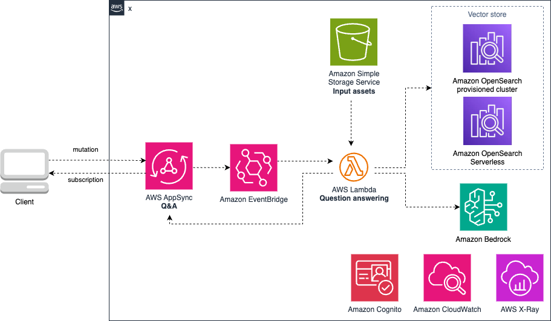

# aws-qa-appsync-opensearch
<!--BEGIN STABILITY BANNER-->

---


> All classes are under active development and subject to non-backward compatible changes or removal in any
> future version. These are not subject to the [Semantic Versioning](https://semver.org/) model.
> This means that while you may use them, you may need to update your source code when upgrading to a newer version of this package.

---
<!--END STABILITY BANNER-->

| **Language**     | **Package**        |
|:-------------|-----------------|
| Typescript|`@awslabs/@emerging_tech_cdk_constructs`|

## Table of contents

- [Overview](#overview)
- [Initializer](#initializer)
- [Pattern Construct Props](#pattern-construct-props)
- [Pattern Properties](#pattern-properties)
- [Default properties](#default-properties)
- [Troubleshooting](#troubleshooting)
- [Architecture](#architecture)
- [Cost](#cost)
- [Security](#security)
- [Supported AWS Regions](#supported-aws-regions)
- [Quotas](#quotas)

## Overview

This construct provides a question answering workflow (RAG + long context window) using Amazon Bedrock and a provisioned Amazon OpenSearch cluster. 
- If a document is provided as an input to the Appsync query, the AWS Lambda function will first verify the length of the document. If the document size is above the max number of tokens for the selected model, the Lambda will query the knowledge base (similarity search) and filter by document name. This assumes that the chunks of texts stored in the knowledge base have the document name as metadata. Otherwise, the content of the document is provided to the LLM as part of the context.
- If no document is provided as input, the Lambda will perform a similarity search against the entire knowledge base.

The construct uses Amazon Bedrock as the Large Language Model provider. amazon.titan-embed-text-v1 is used as the embeddings model to query the knowledge base (provisioned Amazon OpenSearch cluster), and anthropic.claude-v2 for question answering. Make sure both models are enabled in your account. Please follow the [Amazon Bedrock User Guide](https://docs.aws.amazon.com/bedrock/latest/userguide/model-access.html) for steps related to enabling model access.

The input document must be stored in the input Amazon Simple Storage Service bucket in text format (.txt). Another construct is available to ingest and process files to text format and store them in a knowledge base: [aws-rag-appsync-stepfn-opensearch](../aws-rag-appsync-stepfn-opensearch/README.md).

This construct builds a Lambda function from a Docker image, thus you need to have [Docker desktop](https://www.docker.com/products/docker-desktop/) running on your machine.

Here is a minimal deployable pattern definition:

Typescript
``` typescript
import { Construct } from 'constructs';
import { Stack, StackProps } from 'aws-cdk-lib';
import * as os from 'aws-cdk-lib/aws-opensearchservice';
import * as cognito from 'aws-cdk-lib/aws-cognito';
import { QaAppsyncOpensearch, QaAppsyncOpensearchProps } from '@awslabs/generative-ai-cdk-constructs';

// get an existing OpenSearch provisioned cluster
const osDomain = os.Domain.fromDomainAttributes(this, 'osdomain', {
    domainArn: 'arn:aws:es:us-east-1:XXXXXX',
    domainEndpoint: 'https://XXXXX.us-east-1.es.amazonaws.com'
});

// get an existing userpool 
const cognitoPoolId = 'us-east-1_XXXXX';
const userPoolLoaded = cognito.UserPool.fromUserPoolId(this, 'myuserpool', cognitoPoolId);

const rag_source = new emergingTech.QaAppsyncOpensearch(
      this,
      'QaAppsyncOpensearch',
      {
        existingOpensearchDomain: osDomain,
        openSearchIndexName: 'demoindex',
        cognitoUserPool: userPoolLoaded
      }
    )
```

The code below provides an example of a mutation call and associated subscription to trigger a question and get response notifications:

Mutation call to trigger the question:

```
mutation MyMutation {
  postQuestion(jobid: "123", jobstatus: "", max_docs: 10, question: "d2hhdCBpcyB0aGlzIGRvY3VtZW50IGFib3V0ID8=", verbose: true, filename: "document.txt") {
    answer
    jobid
    jobstatus
    max_docs
    question
    verbose
  }
}
```

Where:
- jobid: id which can be used to filter subscriptions on client side
- jobstatus: this field will be used by the subscription to update the status of the question answering process for the file specified
- max_docs: maximum number of documents (chunks) retrieved from the knowledge base if the Retrieveal Augmented Generation (RAG) approach is used 
- question: question to ask as a base64 encoded string
- verbose: boolean indicating if the Langchain chain call verbosity should be enabled or not
- filename: optional. Name of the file stored in the input S3 bucket, in txt format.

Subscription call to get notifications about the question answering process:

```
subscription MySubscription {
  updateQAJobStatus(jobid: "123") {
    sources
    question
    answer
    jobstatus
  }
}
```

Where:
- jobid: id which can be used to filter subscriptions on client side
- answer: response to the question from the Large Language Model as a base64 encoded string
- sources: sources from the knowledge base used as context to answer the question
- jobstatus: status update of the question answering process for the file specified

## Initializer

```
new QaAppsyncOpensearch(scope: Construct, id: string, props: QaAppsyncOpensearchProps)
```

Parameters

- scope [Construct](https://docs.aws.amazon.com/cdk/api/v2/docs/constructs.Construct.html)
- id string
- props QaAppsyncOpensearchProps

## Pattern Construct Props

| **Name**     | **Type**        | **Required** |**Description** |
|:-------------|:----------------|-----------------|-----------------|
| existingOpenSearchDomain | [aws_opensearchservice.IDomain](https://docs.aws.amazon.com/cdk/api/v2/docs/aws-cdk-lib.aws_opensearchservice.IDomain.html)|  | Existing domain for the OpenSearch Service. |
| openSearchIndexName | string |  | Domain endpoint for the OpenSearch Service. |
| cognitoUserPool | [cognito.IUserPool](https://docs.aws.amazon.com/cdk/api/v2/docs/aws-cdk-lib.aws_cognito.IUserPool.html) |  | Cognito user pool used for authentication. |
| openSearchSecret | [aws_secrets_manager.ISecret](https://docs.aws.amazon.com/cdk/api/v2/docs/aws-cdk-lib.aws_secretsmanager.ISecret.html) |  | Optional. Secret containing credentials to authenticate to the existing Amazon OpenSearch domain if fine grain control access if configured. If not provided, the Lambda function will use [AWS Signature Version 4](https://docs.aws.amazon.com/IAM/latest/UserGuide/reference_aws-signing.html). |
| vpcProps | [ec2.VpcProps](https://docs.aws.amazon.com/cdk/api/v2/docs/aws-cdk-lib.aws_ec2.VpcProps.html) |  | Custom properties for a VPC the construct will create. This VPC will be used by the Lambda functions the construct creates. Providing both this and existingVpc is an error. |
| existingVpc | [ec2.IVpc](https://docs.aws.amazon.com/cdk/api/v2/docs/aws-cdk-lib.aws_ec2.IVpc.html) |  | An existing VPC in which to deploy the construct. Providing both this and vpcProps is an error. |
| existingSecurityGroup | [ec2.ISecurityGroup](https://docs.aws.amazon.com/cdk/api/v2/docs/aws-cdk-lib.aws_ec2.ISecurityGroup.html) |  | Existing security group allowing access to opensearch. Used by the lambda functions built by this construct. If not provided, the construct will create one. |
| existingBusInterface | [events.IEventBus](https://docs.aws.amazon.com/cdk/api/v2/docs/aws-cdk-lib.aws_events.IEventBus.html) |  | Existing instance of an Amazon EventBridge bus. If not provided, the construct will create one. |
| existingInputAssetsBucketObj | [s3.IBucket](https://docs.aws.amazon.com/cdk/api/v2/docs/aws-cdk-lib.aws_s3.IBucket.html) |  | Existing instance of S3 Bucket object, providing both this and `bucketInputsAssetsProps` will cause an error. |
| bucketInputsAssetsProps | [s3.BucketProps](https://docs.aws.amazon.com/cdk/api/v2/docs/aws-cdk-lib.aws_s3.BucketProps.html) |  | User provided props to override the default props for the S3 Bucket. Providing both this and `existingInputAssetsBucketObj` will cause an error. |
| stage | string |  | Value will be appended to resources name Service. |
| existingMergedApi | [appsync.CfnGraphQLApi](https://docs.aws.amazon.com/cdk/api/v2/docs/aws-cdk-lib.aws_appsync.CfnGraphQLApi.html) |  | Existing merged api instance. The merge API provides a federated schema over source API schemas.|
| observability | boolean |  | Enables observability on all services used. Warning: associated cost with the services used. Best practice to enable by default. Defaults to true.|

## Pattern Properties

| **Name**     | **Type**        | **Description** |
|:-------------|:----------------|-----------------|
| vpc | [ec2.IVpc](https://docs.aws.amazon.com/cdk/api/v2/docs/aws-cdk-lib.aws_ec2.IVpc.html) | The VPC used by the construct (whether created by the construct or providedb by the client) |
| securityGroup | [ec2.ISecurityGroup](https://docs.aws.amazon.com/cdk/api/v2/docs/aws-cdk-lib.aws_ec2.ISecurityGroup.html) | The VPC used by the construct (whether created by the construct or providedb by the client) |
| qaBus | [events.IEventBus](https://docs.aws.amazon.com/cdk/api/v2/docs/aws-cdk-lib.aws_events.IEventBus.html) | The Event bus used by the construct (whether created by the construct or providedb by the client) |
| s3InputAssetsBucketInterface | [s3.IBucket](https://docs.aws.amazon.com/cdk/api/v2/docs/aws-cdk-lib.aws_s3.IBucket.html) | Returns an instance of s3.IBucket created by the construct |
| s3InputAssetsBucket | [s3.Bucket](https://docs.aws.amazon.com/cdk/api/v2/docs/aws-cdk-lib.aws_s3.Bucket.html) | Returns an instance of s3.Bucket created by the construct. IMPORTANT: If existingInputAssetsBucketObj was provided in Pattern Construct Props, this property will be undefined |
| graphqlApi| [appsync.IGraphqlApi](https://docs.aws.amazon.com/cdk/api/v2/docs/aws-cdk-lib.aws_appsync.GraphqlApi.html) | Returns an instance of appsync.IGraphqlApi created by the construct | 

## Default properties

Out of the box implementation of the Construct without any override will set the following defaults:

### Authentication

- Primary authentication method for the AppSync GraphQL API is Amazon Cognito User Pool.
- Secondary authentication method for the AppSync graphQL API is IAM role.

### Networking

- Set up a VPC
    - Uses existing VPC if provided, otherwise creates a new one
- Set up a Security Group used by the AWS Lambda functions
    - Uses existing Security Group, otherwise creates a new one

### Amazon S3 Bucket

- Uses existing bucket if provided, otherwise creates a new one

### Observability

By default the construct will enable logging and tracing on all services which support those features. Observability can be turned off by setting the pattern property ```observability``` to false. 
- AWS Lambda: AWS X-Ray, Amazon Cloudwatch Logs
- AWS AppSync GraphQL api: AWS X-Ray, Amazon Cloudwatch Logs

## Troubleshooting

| **Error Code**     | **Message**        | **Description** |**Fix** |
|:-------------|:----------------|-----------------|-----------------|
| | Failed to load information about the requested file | This error happens when the Lambda function was not able to load metadata about the file provided as input parameter | Ensure the file is present in the input bucket |
| | Working on the question | The Lambda function started the question processing | Not an error, informational only |
| | Exception during prediction | An issue happened during the prediction process (call to the Large Language Model via Amazon Bedrock) | Verify the Lambda CloudWatch Logs to get access to the related error. One common issue is throtlling. |
| | Done | The process ended successfully | Not an error, informational only |
| | Failed to load document content | This error happens when the Lambda function was not able to load the content of the file provided as input parameter | Ensure the file is present in the input bucket | Ensure the file is present in the input bucket |
| | Failed to load the llm | Internal error related to loading the Large Language Model client | Verify the Lambda error logs to get a detailed description of the issue |

## Architecture


## Cost

You are responsible for the cost of the AWS services used while running this construct. As of this revision, the cost for running this construct with the default settings in the US East (N. Virginia) Region is approximately $X per month.

We recommend creating a budget through [AWS Cost Explorer](http://aws.amazon.com/aws-cost-management/aws-cost-explorer/) to help manage costs. Prices are subject to change. For full details, refer to the pricing webpage for each AWS service used in this solution.

The following table provides a sample cost breakdown for deploying this solution with the default parameters in the **US East (N. Virginia)** Region for **one month**.


| **AWS Service**     | **Dimensions**        | **Cost [USD]** |
|:-------------|:----------------|-----------------|
| Amazon Virtual Private Cloud |  |  |
| AWS AppSync |  |  |
| Amazon EventBridge |  |  |
| AWS Lambda |  |  |
| Amazon Simple Storage Service |  |  |
| Amazon Bedrock |  |  |
| Amazon Cloudwatch | | |
| AWS X-Ray | | |
| AWS X-Ray | | |
| Total Deployment cost | | |

The resources not created by this construct (Amazon Cognito User Pool, Amazon OpenSearch provisioned cluster, AppSync Merged API, AWS Secrets Manager secret) do not appear in the table above. You can refer to the decicated pages to get an estimate of the cost related to those services:
- [Amazon OpenSearch Service Pricing](https://aws.amazon.com/opensearch-service/pricing/)
- [AWS AppSync pricing (for Merged API if used)](https://aws.amazon.com/appsync/pricing/)
- [Amazon Cognito Pricing](https://aws.amazon.com/cognito/pricing/)
- [AWS Secrets Manager Pricing](https://aws.amazon.com/secrets-manager/pricing/)

> **Note**
>You can share the Amazon OpenSearch provisioned cluster between use cases, but this can drive up the number of queries per index and additional charge will apply.

## Security

When you build systems on AWS infrastructure, security responsibilities are shared between you and AWS. This [shared responsibility](http://aws.amazon.com/compliance/shared-responsibility-model/) model reduces your operational burden because AWS operates, manages, and controls the components including the host operating system, virtualization layer, and physical security of the facilities in which the services operate. For more information about AWS security, visit [AWS Cloud Security](http://aws.amazon.com/security/).

## Supported AWS Regions

This solution optionally uses the Amazon Bedrock and Amazon OpenSearch service, which is not currently available in all AWS Regions. You must launch this construct in an AWS Region where these services are available. For the most current availability of AWS services by Region, see the [AWS Regional Services List](https://aws.amazon.com/about-aws/global-infrastructure/regional-product-services/).

> **Note**
>You need to explicity enable access to models before they are available for use in the Amazon Bedrock service. Please follow the [Amazon Bedrock User Guide](https://docs.aws.amazon.com/bedrock/latest/userguide/model-access.html) for steps related to enabling model access.

## Quotas

Service quotas, also referred to as limits, are the maximum number of service resources or operations for your AWS account.

Make sure you have sufficient quota for each of the services implemented in this solution. For more information, refer to [AWS service quotas](https://docs.aws.amazon.com/general/latest/gr/aws_service_limits.html).

To view the service quotas for all AWS services in the documentation without switching pages, view the information in the [Service endpoints and quotas](https://docs.aws.amazon.com/general/latest/gr/aws-general.pdf#aws-service-information) page in the PDF instead.

***
&copy; Copyright Amazon.com, Inc. or its affiliates. All Rights Reserved.