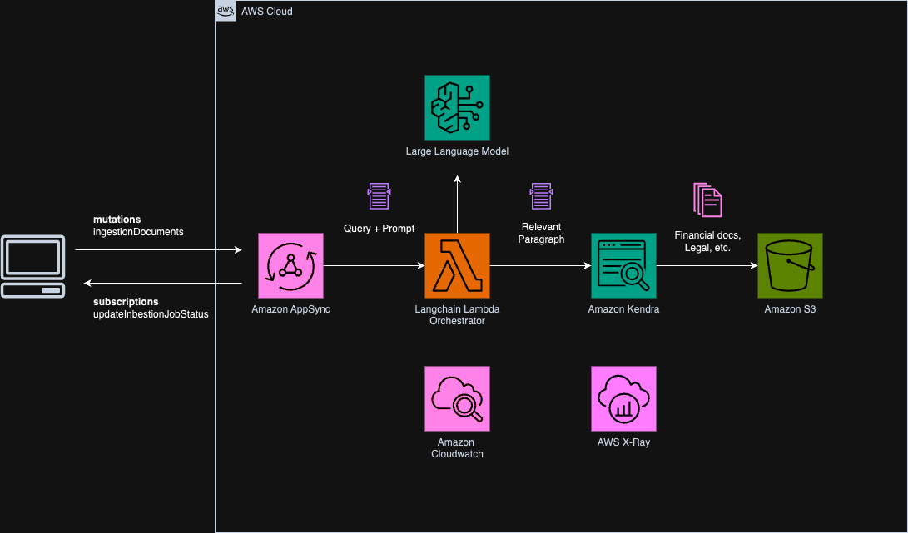

# aws-rag-appsync-stepfn-kendra
<!--BEGIN STABILITY BANNER-->

---


> All classes are under active development and subject to non-backward compatible changes or removal in any
> future version. These are not subject to the [Semantic Versioning](https://semver.org/) model.
> This means that while you may use them, you may need to update your source code when upgrading to a newer version of this package.

---
<!--END STABILITY BANNER-->

| **Language**     | **Package**        |
|:-------------|-----------------|
| TypeScript|`@cdklabs/aws-rag-appsync-stepfn-kendra`|
| Python|`cdklabs.aws_rag_appsync_stepfn_kendra`|

## Table of contents

- [Overview](#overview)
- [Usage](#usage)
- [Prerequisites](#prerequisites)
- [Architecture](#architecture)
- [Cost](#cost)
- [Security](#security)
- [Troubleshooting](#troubleshooting)
- [Clean up](#clean-up)

## Overview

This CDK construct integrates AWS AppSync, AWS Step Functions, Amazon Kendra, and other AWS services to create a solution for document ingestion, processing, and querying. It allows users to upload documents to an S3 bucket, start document processing workflows via AppSync mutations, and query processed documents through Amazon Kendra.

## Usage

### TypeScript

```typescript
import { RagAppsyncStepfnKendra } from '@cdklabs/aws-rag-appsync-stepfn-kendra';

const app = new cdk.App();
const stack = new cdk.Stack(app, 'MyStack');

new RagAppsyncStepfnKendra(stack, 'MyRagAppsyncStepfnKendra', {
  cognitoUserPool: existingCognitoUserPool,
  kendraDataSourcesProps: [
    // Your Kendra data sources configurations
  ],
  // Other configurations
});
```

### Python

```python
from aws_cdk import core
from cdklabs.aws_rag_appsync_stepfn_kendra import RagAppsyncStepfnKendra

app = core.App()
stack = core.Stack(app, "MyStack")

RagAppsyncStepfnKendra(stack, "MyRagAppsyncStepfnKendra",
                       cognito_user_pool=existing_cognito_user_pool,
                       kendra_data_sources_props=[
                           # Your Kendra data sources configurations
                       ],
                       # Other configurations
                       )
```

## Prerequisites

- An existing Amazon Cognito User Pool for authentication.
- An AWS account and AWS CLI configured with necessary permissions.

## Architecture



The construct sets up the following resources:
- An Amazon S3 bucket for document uploads.
- AWS Lambda functions for processing documents and managing Kendra sync jobs.
- An AWS Step Functions workflow to orchestrate document processing steps.
- An Amazon Kendra index for querying processed documents.
- An AWS AppSync GraphQL API for initiating document processing workflows and querying the Kendra index.

## Cost

Costs will vary based on usage and AWS region. Consider the cost of Amazon Kendra indexes, AWS Lambda invocations, AWS Step Functions executions, data transfer, and storage. Use the [AWS Pricing Calculator](https://calculator.aws/#/) to estimate costs based on your expected usage.

## Security

- Use IAM roles and policies to control access to AWS resources.
- Enable AWS CloudTrail to log API calls and related events.
- Use Amazon Cognito for authentication in the AppSync API.
- Follow best practices for securing Amazon S3 buckets and objects.

## Troubleshooting

- **Lambda Invocation Errors**: Check the execution role permissions and ensure the Lambda functions have access to necessary AWS resources.
- **Step Functions Execution Failures**: Review the Step Functions execution history and logs for detailed error messages.
- **Kendra Query Issues**: Ensure the Kendra index is properly configured and the data sources are correctly linked.

## Clean up

To avoid ongoing charges:
1. Delete the AWS CloudFormation stack which removes the created AWS resources.
2. Empty and delete the Amazon S3 buckets if they were created by the construct.
3. Manually remove any resources created outside of the construct, such as the Amazon Cognito User Pool.

---

&copy; 2024 Amazon.com, Inc. or its affiliates. All Rights Reserved.
