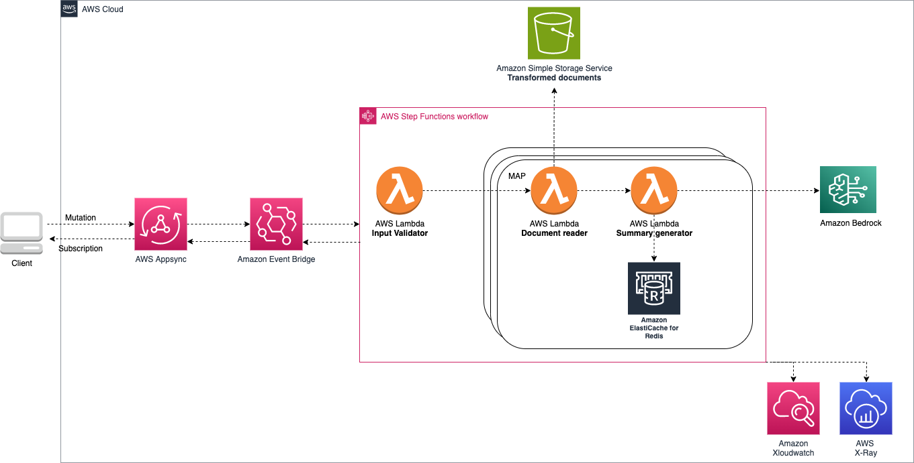

# aws-summarization-appsync-stepfn
<!--BEGIN STABILITY BANNER-->

---


> All classes are under active development and subject to non-backward compatible changes or removal in any
> future version. These are not subject to the [Semantic Versioning](https://semver.org/) model.
> This means that while you may use them, you may need to update your source code when upgrading to a newer version of this package.

---
<!--END STABILITY BANNER-->

| **Language**     | **Package**        |
|:-------------|-----------------|
| TypeScript|`@cdklabs/generative-ai-cdk-constructs`|
| Python|`cdklabs.generative_ai_cdk_constructs`|

## Table of contents

- [Overview](#overview)
- [Initializer](#initializer)
- [Pattern Construct Props](#pattern-construct-props)
- [Pattern Properties](#pattern-properties)
- [Default properties](#default-properties)
- [Troubleshooting](#troubleshooting)
- [Architecture](#architecture)
- [Cost](#cost)
- [Security](#security)
- [Supported AWS Regions](#supported-aws-regions)
- [Quotas](#quotas)
- [Clean up](#clean-up)

## Overview

This construct presents a scalable and decoupled workflow to generate summaries for multiple PDF documents or images using Amazon Bedrock as the foundation. It leverages the state-of-the-art natural language processing capabilities of Anthropic's Claude V2.1/Claude-3 model, integrated with AWS services such as AppSync, Step Functions, Lambda, and EventBridge.

The workflow is initiated by submitting a GraphQL request to AWS AppSync, containing the list of files that require summarization. AppSync acts as the entry point, forwarding the request to an Amazon EventBridge event bus through a custom data source resolver. EventBridge decouples the architecture, enabling asynchronous processing and facilitating the distribution of the request to AWS Step Functions for orchestration.

Step Functions implements a stateful workflow that validates the input request, processes and transforms the files in parallel, and generates summaries for each file. The workflow leverages AWS Lambda functions for specific tasks, such as file validation, transformation, and summarization using the Anthropic Claude model.

The pattern is designed to be configurable, allowing users to customize various aspects of the workflow through the construct's properties. These configurations may include settings for file types, summarization parameters, and other user-specific requirements.

By combining the power of Anthropic's cutting-edge language model with the scalability and flexibility of AWS services, this pattern enables efficient and automated summarization of large volumes of documents or images, streamlining information processing and extraction tasks.

This construct builds a Lambda function from a Docker image, thus you need [Docker desktop](https://www.docker.com/products/docker-desktop/) running on your machine.

The input document(s) must be stored in the input Amazon Simple Storage Service (S3) bucket in text format (.txt). Another construct is available to ingest and process files to text format: [aws-rag-appsync-stepfn-opensearch](../aws-rag-appsync-stepfn-opensearch/README.md).

Make sure the model (anthropic.claude-v2:1) is enabled in your account. Please follow the [Amazon Bedrock User Guide](https://docs.aws.amazon.com/bedrock/latest/userguide/model-access.html) for steps related to enabling model access.

AWS Lambda functions provisioned in this construct use [Powertools for AWS Lambda (Python)](https://github.com/aws-powertools/powertools-lambda-python) for tracing, structured logging and custom metrics creation.

Here is a minimal deployable pattern definition:

Create a CDK TypeScript project and then update the stack with below configuration.

TypeScript
``` typescript
import { Construct } from 'constructs';
import { Stack, StackProps } from 'aws-cdk-lib';
import * as cognito from 'aws-cdk-lib/aws-cognito';
import { SummarizationAppsyncStepfn, SummarizationAppsyncStepfnProps } from '@cdklabs/generative-ai-cdk-constructs';

// get an existing userpool 
const cognitoPoolId = 'us-east-1_XXXXX';
const userPoolLoaded = cognito.UserPool.fromUserPoolId(this, 'myuserpool', cognitoPoolId);

summarizationTestConstruct = new SummarizationAppsyncStepfn(
    this, 
    'SummarizationAppsyncStepfn', 
    {
        cognitoUserPool: userPoolLoaded
    });
    
```

Python
``` python
from constructs import Construct
from aws_cdk import aws_cognito as cognito
from cdklabs.generative_ai_cdk_constructs import SummarizationAppsyncStepfn

# get an existing userpool 
cognito_pool_id = 'us-east-1_XXXXX';
user_pool_loaded = cognito.UserPool.from_user_pool_id(
    self,
    'myuserpool',
    user_pool_id=cognito_pool_id,
)

summarization_test_construct = SummarizationAppsyncStepfn(
    self, 
    'SummarizationAppsyncStepfn', 
    cognito_user_pool=user_pool_loaded,
)
```


If file transformation is required set isFileTransformationRequired to 'True'

 ```
 isFileTransformationRequired: 'True'
 ```

For existing resources like Amazon VPC and Amazon S3 buckets, use props like existingVpc, existingInputAssetsBucketObj, and existingProcessedAssetsBucketObj.

After deploying the CDK stack, the document summarization workflow can be invoked using GraphQL APIs. The API schema details are present here: resources/gen-ai/aws-summarization-appsync-stepfn/schema.graphql.

The code below provides an example of a subscription call and associated mutation to trigger the summarization workflow and get response notifications. The subscription call wait for the mutation request to send the notifications.

Subscription call to receive notifications:

```
subscription MySubscription {
  updateSummaryJobStatus(summary_job_id: "81") {
      name
      status
      summary
      summary_job_id
  }
}
_______________________________________

Expected response:

{
  "data": {
    "updateSummaryJobStatus": {
          "name": "document1.txt",
          "status": "Completed",
          "summary": "<base 64 encoded summary>"
          "summary_job_id": "81"
    }
  }
}
```

Where:
- summary_job_id: id which can be used to filter subscriptions on the client side
- status: status update of the summarization process for the file(s) specified
- name: name of the file stored in the input S3 bucket, same name + extension as passed to the previous mutation call
- summary: summary returned by the large language model for the document specified, as a base64 encoded string

Mutation call to trigger the summarization:

```
mutation MyMutation {
  generateSummary(summaryInput:
    {name: "document1.pdf", status: "", summary: "",
      ignore_existing: false, summary_job_id: "81"}) {
      name
      status
      summary
      summary_job_id
  }
}
_______________________________________

Expected response: It invoke an asynchronous summarization process thus the response notification are send on subscription channel.

{
  "data": {
    "generateSummary": {
      "name": null,
      "summary_job_id": null
    }
  }
}

```

Where:
- summary_job_id: id which can be used to filter subscriptions on client side
- status: this field will be used by the subscription to update the status of the summarization process for the file(s) specified
- name: Two formats are supported for files to be summarized. If the file is in text format, it needs to be stored in the trasformed S3 bucket, no file transformation is required. 
If PDF format is selected, the file needs to be in the input S3 bucket and the construct prop ```isFileTransformationRequired``` needs to be set to true. The file will be transformed to text format.
- ignore_existing: boolean indicating if existing summaries in the cache should be ignored. If true, the input document will be re-summarized, overwriting any existing cached summary for that document.


```If multiple files are requested for summarization , then the client should filter response based on summary_job_id and name for each file. ```

## Initializer

```
new SummarizationAppsyncStepfn(scope: Construct, id: string, props: SummarizationAppsyncStepfnProps)
```

Parameters

- scope [Construct](https://docs.aws.amazon.com/cdk/api/v2/docs/constructs.Construct.html)
- id string
- props SummarizationAppsyncStepfnProps

## Pattern Construct Props

| **Name**     | **Type**        | **Required** |**Description** |
|:-------------|:----------------|-----------------|-----------------|
| cognitoUserPool | [cognito.IUserPool](https://docs.aws.amazon.com/cdk/api/v2/docs/aws-cdk-lib.aws_cognito.IUserPool.html) |  | Amazon Cognito user pool used for authentication. |
| vpcProps | [ec2.VpcProps](https://docs.aws.amazon.com/cdk/api/v2/docs/aws-cdk-lib.aws_ec2.VpcProps.html) |  | The construct creates a custom VPC based on vpcProps. Providing both this and existingVpc will result in an error. |
| existingVpc | [ec2.IVpc](https://docs.aws.amazon.com/cdk/api/v2/docs/aws-cdk-lib.aws_ec2.IVpc.html) |  | An existing VPC can be used to deploy the construct.|
| existingSecurityGroup | [ec2.ISecurityGroup](https://docs.aws.amazon.com/cdk/api/v2/docs/aws-cdk-lib.aws_ec2.ISecurityGroup.html) |  | Security group for the Lambda function which this construct will use. If no exisiting security group is provided it will create one from the VPC.|
| existingInputAssetsBucketObj | [s3.IBucket](https://docs.aws.amazon.com/cdk/api/v2/docs/aws-cdk-lib.aws_s3.Bucket.html) |  | Existing S3 bucket to store the input document to be summarized. PDF is the supported input document format. If transformed (.txt format) file is available, then this bucket is optional. |
| bucketInputsAssetsProps | [s3.BucketProps](https://docs.aws.amazon.com/cdk/api/v2/docs/aws-cdk-lib.aws_s3.BucketProps.html) |  | User-provided props to override the default props for the S3 bucket. Providing both this and `existingInputAssetsBucketObj` will result in an error.|
| isFileTransformationRequired | string |  | The summary construct transforms the input document into .txt format. If the transformation is not required then this flag can be set to false. If set to true, then a transformed asset bucket is created which transforms the input document from input asset bucket to .txt format.|
| existingProcessedAssetsBucketObj | [s3.IBucket](https://docs.aws.amazon.com/cdk/api/v2/docs/aws-cdk-lib.aws_s3.IBucket.html) |  | This bucket stores the transformed (.txt) assets for generating the summary. If none is provided then this contruct will create one.|
| bucketProcessedAssetsProps | [s3.BucketProps](https://docs.aws.amazon.com/cdk/api/v2/docs/aws-cdk-lib.aws_s3.BucketProps.html) |  | User-provided props to override the default props for the S3 bucket. Providing both this and `existingProcessedAssetsBucket` will result in an error.|
| existingBusInterface | [events.IEventBus](https://docs.aws.amazon.com/cdk/api/v2/docs/aws-cdk-lib.aws_events.IEventBus.html) |  | Existing instance of event bus. The summary construct integrates AppSync with EventBridge to route the request to Step Functions.|
| eventBusProps | [events.EventBusProps](https://docs.aws.amazon.com/cdk/api/v2/docs/aws-cdk-lib.aws_events.EventBusProps.html) |  | A new custom event bus is created with provided props. Providing both ```existingBusInterface``` and ```eventBusProps``` will result in an error.|
| existingMergedApi | [appsync.CfnGraphQLApi](https://docs.aws.amazon.com/cdk/api/v2/docs/aws-cdk-lib.aws_appsync.CfnGraphQLApi.html) |  | Existing Merged API instance. The Merged API provides a federated schema over source API schemas.|
| summaryApiName | string |  | User-provided name for summary API on AppSync. A GraphQL API will be created with this name.|
| observability | boolean |  | Enables observability on all services used. Warning: associated costs with the services used. It is a best practice to enable by default. Defaults to true.|
| summaryChainType | string |  | Chain type defines how to pass the document to the LLM. There are three chain types. Stuff: Simply "stuff" all your documents into a single prompt. Map-reduce: Summarize each document on its own in a "map" step and then "reduce" the summaries into a final summary. Refine: Loops over the input documents and iteratively updates its answer. |
| stage | string |  | Value will be appended to resources name service. |
| customDocumentReaderDockerLambdaProps | [DockerLambdaCustomProps](../../../common/props/DockerLambdaCustomProps.ts) |  | Allows to provide document reading custom lambda code and settings instead of the default construct implementation.|
| customInputValidationDockerLambdaProps | [DockerLambdaCustomProps](../../../common/props/DockerLambdaCustomProps.ts) |  | Allows to provide input validation custom lambda code and settings instead of the default construct implementation.|
| customSummaryGeneratorDockerLambdaProps | [DockerLambdaCustomProps](../../../common/props/DockerLambdaCustomProps.ts) |  | Allows to provide summary generation custom lambda code and settings instead of the default construct implementation.|

## Pattern Properties

| **Name**     | **Type**        | **Description** |
|:-------------|:----------------|-----------------|
| eventBridgeBus | [events.IEventBus](https://docs.aws.amazon.com/cdk/api/v2/docs/aws-cdk-lib.aws_events.IEventBus.html) | An instance of events.IEventBus created by the construct |
| mergeApi | [appsync.CfnGraphQLApi](https://docs.aws.amazon.com/cdk/api/v2/docs/aws-cdk-lib.aws_appsync.CfnGraphQLApi.html) |  Instance of appsync.CfnGraphQLApi for Merged API created by the construct |
| graphqlApi | [appsync.IGraphqlApi](https://docs.aws.amazon.com/cdk/api/v2/docs/aws-cdk-lib.aws_appsync.IGraphqlApi.html) | Instance of appsync.CfnGraphQLApi for summary created by the construct|
| vpc | [ec2.IVpc](https://docs.aws.amazon.com/cdk/api/v2/docs/aws-cdk-lib.aws_ec2.IVpc.html) |Returns the instance of ec2.ISecurityGroup used by the construct |
| securityGroup | [ec2.ISecurityGroup](https://docs.aws.amazon.com/cdk/api/v2/docs/aws-cdk-lib.aws_ec2.ISecurityGroup.html) | Returns the instance of ec2.ISecurityGroup used by the construct. |
| inputAssetBucket | [s3.Bucket](https://docs.aws.amazon.com/cdk/api/v2/docs/aws-cdk-lib.aws_s3.Bucket.html) | Instance of s3.IBucket used by the construct |
| processedAssetBucket | [s3.Bucket](https://docs.aws.amazon.com/cdk/api/v2/docs/aws-cdk-lib.aws_s3.Bucket.html) |Instance of s3.IBucket used by the construct|
| summaryGeneratorLambdaFunction| [lambda.DockerImageFunction](https://docs.aws.amazon.com/cdk/api/v2/docs/aws-cdk-lib.aws_lambda.DockerImageFunction.html) | Returns an instance of lambda.DockerImageFunction used for the summary generation job created by the construct |
| documentReaderLambdaFunction| [lambda.DockerImageFunction](https://docs.aws.amazon.com/cdk/api/v2/docs/aws-cdk-lib.aws_lambda.DockerImageFunction.html) | Returns an instance of lambda.DockerImageFunction used for the document reading job created by the construct |
| inputValidationLambdaFunction| [lambda.DockerImageFunction](https://docs.aws.amazon.com/cdk/api/v2/docs/aws-cdk-lib.aws_lambda.DockerImageFunction.html) | Returns an instance of lambda.DockerImageFunction used for the input validation job created by the construct |

## Default properties

Out-of-the-box implementation of the construct without any override will set the following defaults:

### VPC
- Sets up VPC to deploy the contruct


### AppSync
- Sets up AWS AppSync Merged API
    - Associate the source api with Merged API using 'AUTO-MERGE'

### Amazon S3 Buckets

- Sets up two S3 Buckets
    - Uses existing buckets if provided, otherwise creates new ones
- If isFileTransformationRequired is set to False then 
only one bucket is created for input assets

### Observability

By default the construct will enable logging and tracing on all services which support those features. Observability can be turned off through the pattern properties.
- AWS Lambda: AWS X-Ray, Amazon CloudWatch Logs
- AWS Step Functions: AWS X-Ray, Amazon CloudWatch Logs
- AWS AppSync GraphQL API: AWS X-Ray, Amazon CloudWatch Logs


## Troubleshooting

| **Error Code**     | **Message**        | **Description** |**Fix** |
|:-------------|:----------------|-----------------|-----------------|
| 601 | Invalid file format. | Only .txt and .pdf file format are supported | Provide a valid file with .pdf or .txt extension |
| 602 | Not able to transform the file. | File transformation from .pdf to .txt failed | Check if valid file exist in input bucket |
| 603 | No file available to read. | Couldn't read file from input bucket | Check if valid file exist in input bucket |
| 604 | Something went wrong while generating summary! | LLM threw an exception | Check if your account has access to Amazon Bedrock |


## Architecture


## Cost

You are responsible for the cost of the AWS services used while running this construct. As of this revision, the cost for running this construct with the default settings in the US East (N. Virginia) Region is approximately $292.04 per month.

We recommend creating a budget through [AWS Cost Explorer](http://aws.amazon.com/aws-cost-management/aws-cost-explorer/) to help manage costs. Prices are subject to change. For full details, refer to the pricing webpage for each AWS service used in this solution.

The following table provides a sample cost breakdown for deploying this solution with the default parameters in the **US East (N. Virginia)** Region for **one month**.


| **AWS Service**     | **Dimensions**        | **Cost [USD]** |
|:-------------|:----------------|-----------------|
| AWS Step Functions | 15 requests per hour for summarization, each with 2 files (4 steps per workflow) | 0.99 |
| Amazon Virtual Private Cloud |  | 0.00 |
| AWS AppSync | 15 requests per hour to trigger summarization + (15 x 4 calls to notify clients through subscriptions) = 54,000 requests per month | 0.22 |
| Amazon EventBridge | 15 requests per hour = 10800 custom events per month | 0.01 |
| AWS Lambda | 15 summarization requests per hour with 2 files each time, through 4 Lambda functions each allocated with 7076 MB of memory allocated and 512 MB of ephemeral storage allocated and an average run time of 30 seconds = 43200 requests per month | 142.59 |
| Amazon Simple Storage Service | 15 requests per hour for summarization with 2 files in input format (PDF) with an average size of 1MB and transformed files to text format with an average size of 1 MB = 43.2 GB per month in S3 Standard Storage | 0.99 |
| Amazon Bedrock | With the on-demand mode, for text generation models, you are charged for every input token processed and every output token generated. Anthropic.claude model price for 1000 input tokens= $0.01102 and for 1000 output tokens = $0.03268. With a pdf of 50 pages (asumming each page having 200 words) , 50 * 200 , there are 10000 words, which are ~= 7500 tokens. Input token cost for 200 request per month = 7.5 * 0.01102 * 200 = 16.53. Asumming a summary of 200 words (150 tokens) for 200 requests per month cost of output token  = 150 * (0.03268/1000) * 200 = 9.804. Total cost for 200 summary requests , 16.53 + 9.804 = $26.334| 26.34 |
| Amazon CloudWatch | 15 metrics using 5 GB data ingested for logs | 7.02 |
| AWS X-Ray | 100,000 requests per month through AppSync and Lambda calls | 0.50 |
| Total Deployment cost | | 178.16 |

The resources not created by this construct (Amazon Cognito User Pool, AppSync Merged API, AWS Secrets Manager secret) do not appear in the table above. You can refer to the decicated pages to get an estimate of the cost related to those services:
- [AWS AppSync pricing (for Merged API if used)](https://aws.amazon.com/appsync/pricing/)
- [Amazon Cognito Pricing](https://aws.amazon.com/cognito/pricing/)
- [AWS Secrets Manager Pricing](https://aws.amazon.com/secrets-manager/pricing/)

## Security

When you build systems on AWS infrastructure, security responsibilities are shared between you and AWS. This [shared responsibility](http://aws.amazon.com/compliance/shared-responsibility-model/) model reduces your operational burden because AWS operates, manages, and controls the components including the host operating system, virtualization layer, and physical security of the facilities in which the services operate. For more information about AWS security, visit [AWS Cloud Security](http://aws.amazon.com/security/).

This construct requires you to provide an existing Amazon Cognito User Pool. Please refer to the official documentation on best practices to secure this service:
- [Amazon Cognito](https://docs.aws.amazon.com/cognito/latest/developerguide/security.html)

Optionnaly, you can provide existing resources to the constructs (marked optional in the construct pattern props). If you chose to do so, please refer to the official documentation on best practices to secure each service:
- [Amazon Simple Storage Service](https://docs.aws.amazon.com/AmazonS3/latest/userguide/security-best-practices.html)
- [Amazon VPC](https://docs.aws.amazon.com/vpc/latest/userguide/vpc-security-best-practices.html)
- [Amazon EventBridge](https://docs.aws.amazon.com/eventbridge/latest/userguide/eb-security.html)
- [AWS AppSync](https://docs.aws.amazon.com/appsync/latest/devguide/best-practices.html)

If you grant access to a user to your account where this construct is deployed, this user may access information stored by the construct (Amazon Simple Storage Service buckets, Amazon Elasticache, Amazon CloudWatch logs). To help secure your AWS resources, please follow the best practices for [AWS Identity and Access Management (IAM)](https://docs.aws.amazon.com/IAM/latest/UserGuide/best-practices.html).

> **Note**
> This construct requires you to provide documents in the input assets bucket. You should validate each file in the bucket before using this construct. See [here](https://cheatsheetseries.owasp.org/cheatsheets/File_Upload_Cheat_Sheet.html) for file input validation best practices.
> Ensure you only ingest the appropriate documents into your knowledge base. Any results returned by the knowledge base is eligible for inclusion into the prompt; and therefore, being sent to the LLM. If using a third-party LLM, ensure you audit the documents contained within your knowledge base.
> This construct provides several configurable options for logging. Please consider security best practices when enabling or disabling logging and related features. Verbose logging, for instance, may log content of API calls. You can disable this functionality by ensuring observability flag is set to false.

## Supported AWS Regions

This solution optionally uses the Amazon Bedrock service, which is not currently available in all AWS Regions. You must launch this construct in an AWS Region where these services are available. For the most current availability of AWS services by Region, see the [AWS Regional Services List](https://aws.amazon.com/about-aws/global-infrastructure/regional-product-services/).

> **Note**
>You need to explicity enable access to models before they are available for use in the Amazon Bedrock service. Please follow the [Amazon Bedrock User Guide](https://docs.aws.amazon.com/bedrock/latest/userguide/model-access.html) for steps related to enabling model access.

## Quotas

Service quotas, also referred to as limits, are the maximum number of service resources or operations for your AWS account.

Make sure you have sufficient quota for each of the services implemented in this solution. For more information, refer to [AWS service quotas](https://docs.aws.amazon.com/general/latest/gr/aws_service_limits.html).

To view the service quotas for all AWS services in the documentation without switching pages, view the information in the [Service endpoints and quotas](https://docs.aws.amazon.com/general/latest/gr/aws-general.pdf#aws-service-information) page in the PDF instead.

## Clean up

When deleting your stack which uses this construct, do not forget to go over the following instructions to avoid unexpected charges:
  - empty and delete the Amazon Simple Storage Bucket(s) created by this construct if you didn't provide existing ones during the construct creation
  - if the observability flag is turned on, delete all the associated logs created by the different services in Amazon CloudWatch logs

***
&copy; Copyright Amazon.com, Inc. or its affiliates. All Rights Reserved.
