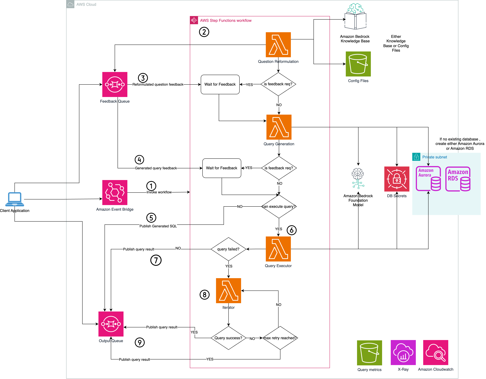

# aws-text-to-sql

<!--BEGIN STABILITY BANNER-->

---


> All classes are under active development and subject to non-backward compatible changes or removal in any
> future version. These are not subject to the [Semantic Versioning](https://semver.org/) model.
> This means that while you may use them, you may need to update your source code when upgrading to a newer version of this package.

---

<!--END STABILITY BANNER-->


| **Language**                                                                                   | **Package**                             |
| :----------------------------------------------------------------------------------------------- | ----------------------------------------- |
|  TypeScript | `@cdklabs/generative-ai-cdk-constructs` |
|  Python             | `cdklabs.generative_ai_cdk_constructs`  |

## Table of contents

- [Overview](#overview)
- [Initializer](#initializer)
- [Pattern Construct Props](#pattern-construct-props)
- [Pattern Properties](#pattern-properties)
- [Default properties](#default-properties)
- [Troubleshooting](#troubleshooting)
- [Architecture](#architecture)
- [Cost](#cost)
- [Security](#security)
- [Supported AWS Regions](#supported-aws-regions)
- [Quotas](#quotas)
- [Clean up](#clean-up)

## Overview

This CDK construct leverages state-of-the-art generative AI capabilities to facilitate natural language-based SQL query generation. It seamlessly integrates with your choice of database (MySQL, PostgreSQL, or SQLite) on AWS, currently supporting MySQL databases.

To address the inherent ambiguity present in natural language, the system employs a sophisticated semantic linking mechanism. This mechanism utilizes a knowledge layer loaded from configuration files or an Amazon Bedrock knowledge base to reformulate the user's query, disambiguating and clarifying the intent. The system then prompts the user for feedback on the reformulated query, ensuring accurate interpretation of the user's intent. Upon user approval of the reformulated query, the construct generates the corresponding SQL query and presents it to the user for further validation.

Once the user approves the generated SQL query, they have the option to execute it against the target database. In the event of any issues with the generated query, the construct is equipped with an autocorrection mechanism that allows for a configurable number of retries.

The system's architecture is built upon a serverless workflow orchestrated by AWS Step Functions and AWS Lambda, triggered by an Amazon EventBridge event. The AWS Step Functions workflow publishes a task token on an Amazon Simple Queue Service (SQS) queue and awaits user feedback, ensuring a seamless and efficient user experience. The feedback strategy is configurable in config files and can be skipped by updating the config files.


The construct support anthropic claude 3 models (anthropic.claude-3-haiku-20240307-v1:0, anthropic.claude-3-sonnet-20240229-v1:0). Please make sure the model is enabled in your account.Please follow the [Amazon Bedrock User Guide](https://docs.aws.amazon.com/bedrock/latest/userguide/model-access.html) for steps related to enabling model access.

This construct builds a Lambda function from a Docker image, thus you need [Docker desktop](https://www.docker.com/products/docker-desktop/) running on your machine.

AWS Lambda functions provisioned in this construct use [Powertools for AWS Lambda (Python)](https://github.com/aws-powertools/powertools-lambda-python) for tracing, structured logging and custom metrics creation.

Here is a minimal deployable pattern definition:

Create a CDK TypeScript project and then update the stack with below configuration.

TypeScript

```typescript
import { Construct } from 'constructs';
import { Stack, StackProps } from 'aws-cdk-lib';
import * as emergingTech from '@cdklabs/generative-ai-cdk-constructs';

// db secret arn
const secretCompleteArn = "arn:aws:xxx"
const textToSql  = new  emergingTech.TextToSql(this, "TextToSql", {
      databaseSecretARN: secretCompleteArn,
      dbName: emergingTech.DbName.MYSQL,
      metadataSource: emergingTech.MetatdataSource.CONFIG_FILE,
      stage:"dev",
    })  
```

Python

```python
from constructs import Construct
from aws_cdk import aws_cognito as cognito
from cdklabs.generative_ai_cdk_constructs import TextToSql

secret_complete_arn = "arn:aws:xxx"
text_to_sql_construct = TextToSql(
    self, 
    'TextToSql', 
     database_secret_arn= secret_complete_arn,
     db_name= TextToSql.DbName.MYSQL,
     metadata_source=TextToSql.MetatdataSource.CONFIG_FILE,
     stage="dev",
)
```

Invoke the Step Functions workflow by sending a sample Event Bridge message


## Initializer

```
new  TextToSql(scope: Construct, id: string, props: TextToSqlProps)
```

Parameters

- scope [Construct](https://docs.aws.amazon.com/cdk/api/v2/docs/constructs.Construct.html)
- id string
- props TextToSqlProps

## Config Files

The Text to SQL workflow is orchestrated by the workflow_config.json file, which dictates the primary execution flow.

Semantic layer Configuration to reduce the natural language ambiguity
```json
"semantic_layer": {
        "strategy": "auto", // Set to "human" to enable interactive feedback, set to "auto" for no feedback operation,
        "config_files":{ // either config file or knowledge_base is used
            "prompt_template_path": "config/knowledge_layer_prompt.json"
        },
        "knowledge_base": {
            "kb_prompt_template_path": "config/kb_schema_linking_prompt.json",
            "id": "", // knowledge base id
            "embedding_model": "amazon.titan-text-lite-v1"
        },     
        "model_id": "anthropic.claude-3-haiku-20240307-v1:0",
        "topp": 1,
        "topk": 1,
        "temperature": 0
    },
```
  
To generate the sql
  
```json
"sql_generation": {
    "strategy": "auto", // Set to "human" to enable interactive feedback, set to "auto" for no feedback operation
    "sql_generation_prompt_path": "", // If none , then default prompts for sql generation are used
    "few_shots_examples": "config/few_shots.json", //
    "few_shot_strategy": "static", // Utilize a fixed set of few-shot examples
    "max_few_shots": 5, // Maximum number of few-shot examples to provide
    "model_id": "anthropic.claude-3-haiku-20240307-v1:0", // Specify the Anthropic Claude model to use
    "nucleus_sampling_topp": 1, // Nucleus sampling top-p value (0-1 range)
    "top_k_sampling": 1, // Top-k sampling value
    "temperature": 0, // Sampling temperature (0 = greedy, higher values increase randomness)
    "generation_prompt_template_path": "config/X.json", // Path to the generation prompt template
    "validation_prompt_template_path": "config/X.json" // Path to the validation prompt template
},
```
   To execute the query
```json
"sql_execution": {
    "strategy": "human" // Setting the "strategy" value to "human" execute the generated query , "disabled" skip the query execution and returned generated query.
},
    
  To format the query result output with llm
  ```json
  "sql_synth": {
        "strategy": "auto", // Setting the "strategy" to "disabled" will skip the query result formatting eith llm
        "prompt_template_path": "config/sql_synth_prompt.json",
        "model_id": "anthropic.claude-3-haiku-20240307-v1:0",
        "topp": 1,
        "topk": 1,
        "temperature": 0
    },
  ```
  

  To generate query metrics
  ```json
  "generate_metrics": {
        "strategy": "auto", // "auto" save the query metrics in a csv file and "disabled" can skip query metrics.
        "metrics_file_name": "metric/texttosql_metrics.csv"  
    }
  ```
## Pattern Construct Props


| **Name**                         | **Type**                                                                                                             | **Required**                                              | **Description**                                                                                                                                      |
| :--------------------------------- | :--------------------------------------------------------------------------------------------------------------------- | ----------------------------------------------------------- | ------------------------------------------------------------------------------------------------------------------------------------------------------ |
| dbName                           | string                                                                                                               |  | Database name. This is the target database against which the query will be generated.                                                                |
| metadataSource                   | string                                                                                                               |  | Two metatdata source are supported: 1. config_file 2. Knowledge base                                                                                 |
| databaseSecretARN                   | string                                                                                                               |  | The complete ARN is the ARN with the Secrets Manager-supplied suffix. This secret stores database credentials.                                                                                 |
| vpcProps                         | [ec2.VpcProps](https://docs.aws.amazon.com/cdk/api/v2/docs/aws-cdk-lib.aws_ec2.VpcProps.html)                        |  | The construct creates a custom VPC based on vpcProps. Providing both this and existingVpc will result in an error.                                   |
| existingVpc                      | [ec2.IVpc](https://docs.aws.amazon.com/cdk/api/v2/docs/aws-cdk-lib.aws_ec2.IVpc.html)                                |  | An existing VPC can be used to deploy the construct.                                                                                                 |
| existingSubnetGroup              | [rds.SubnetGroup](https://docs.aws.amazon.com/cdk/api/v2/docs/aws-cdk-lib.aws_rds.SubnetGroup.html)                  |  | An existing subnet group can be used to deploy the construct.                                                                                        |
| existingLambdaSecurityGroup      | [ec2.ISecurityGroup](https://docs.aws.amazon.com/cdk/api/v2/docs/aws-cdk-lib.aws_ec2.ISecurityGroup.html)            |  | Security group for the Lambda function which this construct will use. If no exisiting security group is provided it will create one from the VPC.    |
| existingDBSecurityGroup          | [ec2.ISecurityGroup](https://docs.aws.amazon.com/cdk/api/v2/docs/aws-cdk-lib.aws_ec2.ISecurityGroup.html)            |  | Security group for the database which this construct will use. If no exisiting security group is provided it will create one from the VPC.           |
| existingconfigAssetsBucketObj    | [s3.IBucket](https://docs.aws.amazon.com/cdk/api/v2/docs/aws-cdk-lib.aws_s3.Bucket.html)                             |  | Existing S3 bucket to store the config files.                                                                                                        |
| configAssetsBucketProps          | [s3.BucketProps](https://docs.aws.amazon.com/cdk/api/v2/docs/aws-cdk-lib.aws_s3.BucketProps.html)                    |  | User-provided props to override the default props for the S3 bucket. Providing both this and`existingconfigAssetsBucketObj` will result in an error. |
| stage                            | string                                                                                                               |  | Value will be appended to resources name service.                                                                                                    |
| observability                    | boolean                                                                                                              |  | Enable cloudwatch logging.                                                                | 
| customQueryConfigurerLambdaProps | [DockerLambdaCustomProps](../../../common/props/DockerLambdaCustomProps.ts)                                          |  | Allows to provide custom lambda code for all pre steps required before generating the query.                                                         |
| customQueryGeneratorLambdaProps  | [DockerLambdaCustomProps](../../../common/props/DockerLambdaCustomProps.ts)                                          |  | Allows to provide custom lambda code for generating the query.                                                                                       |
| customFeedbackLambdaProps        | [DockerLambdaCustomProps](../../../common/props/DockerLambdaCustomProps.ts)                                          |  | Allows to provide custom lambda code for requesting the feedback from the user.                                                                      |
| customQueryExecutorLambdaProps   | [DockerLambdaCustomProps](../../../common/props/DockerLambdaCustomProps.ts)                                          |  | Allows to provide custom lambda code for executing the query.                                                                                        |
| existingKnowledgeBaseId          | string                                                                                                               |  | Existing Knowledge base ID.                                                                                                                          |

## Pattern Properties


| **Name**            | **Type**                                                                                                        | **Description**                                                  |
| :-------------------- | :---------------------------------------------------------------------------------------------------------------- | ------------------------------------------------------------------ |
| vpc                 | [ec2.IVpc](https://docs.aws.amazon.com/cdk/api/v2/docs/aws-cdk-lib.aws_ec2.Vpc.html)                            | Returns the instance of ec2.IVpc used by the construct           |
| subnetGroup         | [rds.SubnetGroup](https://docs.aws.amazon.com/cdk/api/v2/docs/aws-cdk-lib.aws_rds.SubnetGroup.html)             | Returns the instance of subnet group used by the construct       |
| lambdaSecurityGroup | [ec2.ISecurityGroup](https://docs.aws.amazon.com/cdk/api/v2/docs/aws-cdk-lib.aws_ec2.SecurityGroup.html)        | Returns the instance of ec2.ISecurityGroup used by the construct |
| dbSecurityGroup     | [ec2.ISecurityGroup](https://docs.aws.amazon.com/cdk/api/v2/docs/aws-cdk-lib.aws_ec2.SecurityGroup.html)        | Returns the instance of ec2.ISecurityGroup used by the construct |
| configAssetBucket   | [s3.IBucket](https://docs.aws.amazon.com/cdk/api/v2/docs/aws-cdk-lib.aws_s3.Bucket.html)                        | Returns the instance of s3.IBucket used by the construct         |
| secret              | [secretsmanager.Secret](https://docs.aws.amazon.com/cdk/api/v2/docs/aws-cdk-lib.aws_secretsmanager.Secret.html) | Returns the instance of secret manager used by the construct     |

## Default properties

Out-of-the-box implementation of the construct without any override will set the following defaults:

### VPC, Private Subnet and Security group

- Sets up VPC to deploy the contruct with public and private subnet.

### Amazon S3 Buckets

- Sets up S3 Bucket
  - Uses existing buckets if provided, otherwise creates new one

### Observability

By default the construct will enable logging and tracing on all services which support those features. Observability can be turned off through the pattern properties.

- AWS Lambda: AWS X-Ray, Amazon CloudWatch Logs
- AWS Step Functions: AWS X-Ray, Amazon CloudWatch Logs

## Troubleshooting


| **Error Code** | **Message** | **Description** | **Fix** |
| :--------------- | :------------ | ----------------- | --------- |

## Architecture



## Cost

Please note that you will be responsible for the costs associated with the AWS services utilized during the execution of this construct. As of the current revision, the estimated monthly cost for running this construct for 40,000 requests and 150 hours of db usage with the default configurations in the US East (N. Virginia) Region  is approximately $264.85. **This cost estimation is based on the on-demand settings. The actual cost may vary depending on your usage patterns.** In scenarios of lower usage, the cost will decrease accordingly.

We recommend creating a budget through [AWS Cost Explorer](http://aws.amazon.com/aws-cost-management/aws-cost-explorer/) to help manage costs. Prices are subject to change. For full details, refer to the pricing webpage for each AWS service used in this solution.

The following table provides a sample cost breakdown for deploying this solution with the default parameters in the **US East (N. Virginia)** Region for **one month**.


| **AWS Service**               | **Dimensions**                                                                                                                                  | **Monthly Cost [USD]** |
| :------------------------------ | :------------------------------------------------------------------------------------------------------------------------------------------------ | ------------------------ |
| AWS Step Functions            | 100000 workflow request with maximum 15 state transition                                                                                        | 37.40                  |
| Amazon EventBridge            | 1 million custom events with payload size of 10 kb                                                                                              | 1                      |
| AWS Lambda                    | 100000 invocation request, x86 arch, 3 sec duration of each request, 7076 MB, ephermal storage 512 MB. ~~ 27.88 per lambda function . 4 X 27.88 | 111.52                 |
| Amazon Simple Storage Service | 100000 GET request, 100 GB data transfer.                                                                                                       | 0.11                   |
| Amazon Bedrock                | With the on-demand mode, for around 2000 request per day with 2000 input token and 1000 output token per request, with Anthropic Claude 3 Haiku | 95.00                  |
| Amazon Aurora MySql** (The construct don't create any database by itself, the db credentials are passed to construct from your sample app)           | With 1 Node , db.t3.medium size, 150 hours of usage per month(1 instance(s) x 0.082 USD hourly x 150 hours in a month)                          | 12.30                  |
| Amazon CloudWatch             | 15 metrics using 5 GB data ingested for logs                                                                                                    | 7.02                   |
| AWS X-Ray                     | 100,000 requests per month through AppSync and Lambda calls                                                                                     | 0.50                   |
| Total Deployment cost         | For roughly around 40,000 requests(2000 input tokens / average request and 1000 output tokens/ average request)                                 | 264.85                 |

The resources not created by this construct ( AWS Secrets Manager secret ) do not appear in the table above. You can refer to the decicated pages to get an estimate of the cost related to those services:

- [AWS Secrets Manager Pricing](https://aws.amazon.com/secrets-manager/pricing/)

## Security

When you build systems on AWS infrastructure, security responsibilities are shared between you and AWS. This [shared responsibility](http://aws.amazon.com/compliance/shared-responsibility-model/) model reduces your operational burden because AWS operates, manages, and controls the components including the host operating system, virtualization layer, and physical security of the facilities in which the services operate. For more information about AWS security, visit [AWS Cloud Security](http://aws.amazon.com/security/).

Optionaly, you can provide existing resources to the constructs (marked optional in the construct pattern props). If you chose to do so, please refer to the official documentation on best practices to secure each service:

- [Amazon VPC](https://docs.aws.amazon.com/vpc/latest/userguide/vpc-security-best-practices.html)
- [Amazon EventBridge](https://docs.aws.amazon.com/eventbridge/latest/userguide/eb-security.html)


If you grant access to a user to your account where this construct is deployed, this user may access information stored by the construct (Amazon Simple Storage Service buckets, Amazon Elasticache, Amazon CloudWatch logs). To help secure your AWS resources, please follow the best practices for [AWS Identity and Access Management (IAM)](https://docs.aws.amazon.com/IAM/latest/UserGuide/best-practices.html).


In aws-text-to-sql construct workflows, you may encounter scenarios where you need to execute SQL queries against your database. To ensure secure and controlled access, it's essential to follow best practices. 

 - Create a dedicated database user with read-only permissions.This user should have the minimum required privileges to execute the desired SQL queries.

 - The SQL query execution strategy is controlled by the `workflow_config.json` file. This configuration file allows you to enable or disable SQL query execution within your AWS workflow.

```json
"sql_execution": {
    "strategy": "disabled"
}
```

> **Note**

> This construct provides several configurable options for logging. Please consider security best practices when enabling or disabling logging and related features. Verbose logging, for instance, may log content of API calls. You can disable this functionality by ensuring observability flag is set to false.

## Supported AWS Regions

This solution optionally uses the Amazon Bedrock service, which is not currently available in all AWS Regions. You must launch this construct in an AWS Region where these services are available. For the most current availability of AWS services by Region, see the [AWS Regional Services List](https://aws.amazon.com/about-aws/global-infrastructure/regional-product-services/).

> **Note**
> You need to explicity enable access to models before they are available for use in the Amazon Bedrock service. Please follow the [Amazon Bedrock User Guide](https://docs.aws.amazon.com/bedrock/latest/userguide/model-access.html) for steps related to enabling model access.

## Quotas

Service quotas, also referred to as limits, are the maximum number of service resources or operations for your AWS account.

Make sure you have sufficient quota for each of the services implemented in this solution. For more information, refer to [AWS service quotas](https://docs.aws.amazon.com/general/latest/gr/aws_service_limits.html).

To view the service quotas for all AWS services in the documentation without switching pages, view the information in the [Service endpoints and quotas](https://docs.aws.amazon.com/general/latest/gr/aws-general.pdf#aws-service-information) page in the PDF instead.

## Clean up

When deleting your stack which uses this construct, do not forget to go over the following instructions to avoid unexpected charges:

- empty and delete the Amazon Simple Storage Bucket(s) created by this construct if you didn't provide existing ones during the construct creation
- if the observability flag is turned on, delete all the associated logs created by the different services in Amazon CloudWatch logs

---

&copy; Copyright Amazon.com, Inc. or its affiliates. All Rights Reserved.
