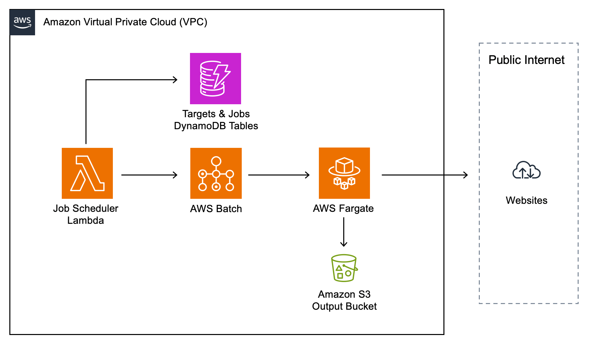

# aws-web-crawler
<!--BEGIN STABILITY BANNER-->

---


> All classes are under active development and subject to non-backward compatible changes or removal in any
> future version. These are not subject to the [Semantic Versioning](https://semver.org/) model.
> This means that while you may use them, you may need to update your source code when upgrading to a newer version of this package.

---
<!--END STABILITY BANNER-->

| **Language**     | **Package**        |
|:-------------|-----------------|
| TypeScript|`@cdklabs/generative-ai-cdk-constructs`|
| Python|`cdklabs.generative_ai_cdk_constructs`|

## Table of contents
- [Overview](#overview)
- [Initializer](#initializer)
- [Pattern Construct Props](#pattern-construct-props)
- [Pattern Properties](#pattern-properties)
- [Default properties](#default-properties)
- [Crawler Output](#crawler-output)
- [Architecture](#architecture)
- [Web Crawler Agent for Amazon Bedrock](#web-crawler-agent-for-amazon-bedrock)
- [Cost](#cost)
- [Security](#security)
- [Supported AWS Regions](#supported-aws-regions)
- [Quotas](#quotas)
- [Clean up](#clean-up)

## Overview

The WebCrawler construct provided here simplifies website crawling. It can crawl websites and RSS feeds on a schedule and store changeset data on S3. WebCrawler construct uses [Crawlee](https://crawlee.dev/) library to crawl websites. 

Crawling will begin shortly after the stack deployment. Please allow up to **15 minutes** for it to start the first time. 

All job status changes are notified via the SNS Topic available through the `snsTopic` property.

Here is a minimal deployable pattern definition:

TypeScript
```typescript
import * as cdk from 'aws-cdk-lib';
import { Construct } from 'constructs';
import { CrawlerTargetType, WebCrawler } from '@cdklabs/generative-ai-cdk-constructs';

export class SampleStack extends cdk.Stack {
  constructor(scope: Construct, id: string, props?: cdk.StackProps) {
    super(scope, id, props);

    new WebCrawler(this, 'WebCrawler', {
      targets: [
        {
          url: 'https://cloudprice.net/aws/ec2',
          targetType: CrawlerTargetType.WEBSITE,
          crawlIntervalHours: 24,
          maxRequests: 15000,
        },
        {
          url: 'https://aws.amazon.com/about-aws/whats-new/recent/feed',
          targetType: CrawlerTargetType.RSS_FEED,
          crawlIntervalHours: 24,
        },
      ],
    });
  }
}

```

Python
```python
from aws_cdk import Stack
from constructs import Construct
from cdklabs.generative_ai_cdk_constructs import WebCrawler, CrawlerTargetType

class SampleStack(Stack):
    def __init__(self, scope: Construct, id: str, **kwargs):
        super().__init__(scope, id, **kwargs)

        WebCrawler(self, 'WebCrawler',
            targets=[
                {
                    'url': 'https://cloudprice.net/aws/ec2',
                    'target_type': CrawlerTargetType.WEBSITE,
                    'crawl_interval_hours': 24,
                    'max_requests': 15000,
                },
                {
                    'url': 'https://aws.amazon.com/about-aws/whats-new/recent/feed',
                    'target_type': CrawlerTargetType.RSS_FEED,
                    'crawl_interval_hours': 24,
                }
            ]
        )
```

## Initializer

```
new WebCrawler(scope: Construct, id: string, props: WebCrawlerProps)
```

Parameters

- scope [Construct](https://docs.aws.amazon.com/cdk/api/v2/docs/constructs.Construct.html)
- id string
- props [WebCrawlerProps](../aws-web-crawler/index.ts)

## Pattern Construct Props

| **Name**     | **Type**        | **Required** |**Description** |
|:-------------|:----------------|-----------------|-----------------|
| existingVpc | [ec2.IVpc](https://docs.aws.amazon.com/cdk/api/v2/docs/aws-cdk-lib.aws_ec2.IVpc.html) |  | An existing VPC can be used to deploy the construct.|
| vpcProps | [ec2.VpcProps](https://docs.aws.amazon.com/cdk/api/v2/docs/aws-cdk-lib.aws_ec2.VpcProps.html) |  | Optional custom properties for a VPC the construct will create. This VPC will be used by the compute resources the construct creates. Providing both this and existingVpc is an error.|
| existingOutputBucketObj | [s3.IBucket](https://docs.aws.amazon.com/cdk/api/v2/docs/aws-cdk-lib.aws_s3.IBucket.html) |  | Existing instance of S3 Bucket object, providing both this and `bucketOutputProps` will cause an error..|
| bucketOutputProps | [s3.BucketProps](https://docs.aws.amazon.com/cdk/api/v2/docs/aws-cdk-lib.aws_s3.BucketProps.html) |  | User provided props to override the default props for the S3 Bucket. Providing both this and `existingOutputBucketObj` will cause an error.|
| observability | boolean |  | Enables observability on all services used. Warning: associated costs with the services used. It is a best practice to enable by default. Defaults to true.|
| stage | string |  | Value will be appended to resources name service. |
| targets | CrawlerTarget[] |  | Target websited and RSS feeds to be crawled |
| enableLambdaCrawler | boolean |  | Specifies whether a separate crawler available as a Lambda function should be deployed. |

## Target Properties

| **Name**     | **Type** |**Description** |
|:-------------|:----------------|-----------------|
| vpc | [ec2.IVpc](https://docs.aws.amazon.com/cdk/api/v2/docs/aws-cdk-lib.aws_ec2.IVpc.html) | The VPC used by the construct (whether created by the construct or provided by the client). |
| dataBucket | [s3.IBucket](https://docs.aws.amazon.com/cdk/api/v2/docs/aws-cdk-lib.aws_s3.IBucket.html) | Returns an instance of s3.Bucket created by the construct. |
| snsTopic | [sns.ITopic](https://docs.aws.amazon.com/cdk/api/v2/docs/aws-cdk-lib.aws_sns.ITopic.html) | Returns an instance of SNS Topic created by the construct. |
| targetsTable | [dynamodb.ITable](https://docs.aws.amazon.com/cdk/api/v2/docs/aws-cdk-lib.aws_dynamodb.ITable.html) | Returns the instance of Targets DynamoDB table created by the construct. |
| jobsTable | [dynamodb.ITable](https://docs.aws.amazon.com/cdk/api/v2/docs/aws-cdk-lib.aws_dynamodb.ITable.html) | Returns the instance of Jobs DynamoDB table created by the construct. |
| jobQueue | [batch.IJobQueue](https://docs.aws.amazon.com/cdk/api/v2/docs/aws-cdk-lib.aws_batch.IJobQueue.html) | Returns the instance of batch.IJobQueue created by the construct. |
| webCrawlerJobDefinition | [batch.IJobDefinition](https://docs.aws.amazon.com/cdk/api/v2/docs/aws-cdk-lib.aws_batch.IJobDefinition.html) | Returns the instance of JobDefinition created by the construct. |
| lambdaCrawler | [lambda.IFunction](https://docs.aws.amazon.com/cdk/api/v2/docs/aws-cdk-lib.aws_lambda.IFunction.html) | Returns the instance of the lambda function created by the construct if ```enableLambdaCrawler``` was set to true in the construct properties. |
| lambdaCrawlerApiSchemaPath | string | Returns the path to the OpenAPI specification for the Lambda Crawler. |

## Default properties

Out of the box implementation of the construct without any override will set the following defaults:

### Networking

- Set up a VPC
    - Uses existing VPC if provided, otherwise creates a new one
    - Setup VPC endpoints for Amazon S3 and ECR
    - Setup a VPC flow logs

### Fargate

- when an infrastructure update is triggered, any running jobs will be allowed to run until 30min has expired
- 2vCPUs
- 6144 MB as the container memory hard limit
- hard limit of 48 hours for container timeout, and 100 000 pages crawled

### Amazon S3 Buckets

- Set up one Amazon S3 Bucket
    - Uses existing bucket if provided, otherwise creates new one
- Setup a logging access S3 bucket

## Crawler Output

S3 output bucket names is available via `dataBucket` property. Data is stored on S3 in the following format:
- /{target_key}/files/{file_name}
- /{target_key}/jobs/{job_id}/{data_file}

| File Name | Description |
| -------- | ------- |
| crawl_data.jsonl | Raw HTML crawler output |
| crawl_files.jsonl| Links to files found on crawled pages |
| crawl_errors.jsonl| Crawler errors |
| crawl_sitemaps.jsonl| Links found in sitemaps |
| pages_changeset.jsonl| Cleaned data in text format from the pages, including information on whether the page was created, updated, deleted or not changed after a previous crawl. |
| files_changeset.jsonl| All downloaded files data including S3 key and information on whether the file was added, changed, or deleted after a previous crawl |

All files are stored in jsonl format (JSON Lines) and can be processed line by line. Here is a Python snippet.

```python
import json

with open(FILE_NAME, 'r') as file:
    for line in file:
        try:
            json_data = json.loads(line)
            # TODO: Process the JSON data
        except json.JSONDecodeError as e:
            print(f"Error decoding JSON: {e}")
```

Page records have the following format

```ts
{
  content_type: string;
  url: string;
  base_url?: string;
  file_type?: string;
  canonical?: string;
  meta?: {
    title?: string;
    description?: string;
    keywords?: string;
    author?: string;
  }
  content?: string;
  fingerprint?: string;
  operation?: string;
}
```

File records have the following format

```ts
{
  url: string;
  file_type: string;
  file_size: number;
  last_modified: string,
  checksum?: string,
  s3_key?: string
  operation?: string;
}
```

Operations:
- not_changed
- created
- updated
- deleted

## Architecture


## Web Crawler Agent for Amazon Bedrock

The WebCrawler construct also provides a Lambda Crawler function that can be used as an action in the Amazon Bedrock Agent. Here is an example of an agent capable of accessing the web.

```typescript
import * as cdk from 'aws-cdk-lib';
import { Construct } from 'constructs';
import { WebCrawler, bedrock } from '@cdklabs/generative-ai-cdk-constructs';

export class WebCrawlerAgentStack extends cdk.Stack {
  constructor(scope: Construct, id: string, props?: cdk.StackProps) {
    super(scope, id, props);

    const crawler = new WebCrawler(this, 'WebCrawler', {
      enableLambdaCrawler: true,
    });

    const agent = new bedrock.Agent(this, 'WebAgent', {
      foundationModel: bedrock.BedrockFoundationModel.ANTHROPIC_CLAUDE_SONNET_V1_0,
      instruction: `You are a helpful and friendly agent with access to the internet. 
      You can get content from web pages provided by an URL. 
      You can summarize web pages.`,
    });

    agent.addActionGroup(
      new bedrock.AgentActionGroup(this, 'WebCrawlerActionGroup', {
        actionGroupName: 'web-crawler',
        description: 'Use this function to get content from a web page by HTTP or HTTPS URL',
        actionGroupExecutor: crawler.lambdaCrawler,
        actionGroupState: 'ENABLED',
        apiSchema: bedrock.ApiSchema.fromAsset(crawler.lambdaCrawlerApiSchemaPath),
      }),
    );
  }
}

```

## Cost

When deploying this architecture, you as the customer are responsible for the costs of the AWS services utilized. Based on current pricing in the US East (N. Virginia) region, operating this infrastructure with the default configuration to crawle websites every day for 4 hours is estimated to cost approximately $52.75 per month. This cost estimate includes usage of the various AWS services leveraged in this architecture such as AWS Lambda, AWS Batch, AWS Fargate, and Amazon S3. 

We recommend creating a budget through [AWS Cost Explorer](http://aws.amazon.com/aws-cost-management/aws-cost-explorer/) to help manage costs. Prices are subject to change. For full details, refer to the pricing webpage for each AWS service used in this solution.

The following table provides a sample cost breakdown for deploying this solution with the default parameters in the **US East (N. Virginia)** Region for **one month**.

| **AWS Service**     | **Dimensions**        | **Cost [USD]** |
|:-------------|:----------------|-----------------|
| Amazon Virtual Private Cloud |  | 37.35 |
| Amazon Simple Storage Service (S3) | 100 GB / month | 2.30 |
| AWS Fargate | 4 hours per day  | 13.10 |


## Security

When you build systems on AWS infrastructure, security responsibilities are shared between you and AWS. This [shared responsibility](http://aws.amazon.com/compliance/shared-responsibility-model/) model reduces your operational burden because AWS operates, manages, and controls the components including the host operating system, virtualization layer, and physical security of the facilities in which the services operate. For more information about AWS security, visit [AWS Cloud Security](http://aws.amazon.com/security/).

Optionnaly, you can provide existing resources to the constructs (marked optional in the construct pattern props). If you chose to do so, please refer to the official documentation on best practices to secure each service:
- [Amazon Simple Storage Service](https://docs.aws.amazon.com/AmazonS3/latest/userguide/security-best-practices.html)
- [Amazon VPC](https://docs.aws.amazon.com/vpc/latest/userguide/vpc-security-best-practices.html)

If you grant access to a user to your account where this construct is deployed, this user may access information stored by the construct (Amazon Simple Storage Service buckets, Amazon CloudWatch logs). To help secure your AWS resources, please follow the best practices for [AWS Identity and Access Management (IAM)](https://docs.aws.amazon.com/IAM/latest/UserGuide/best-practices.html).

> **Note**

> This construct stores documents in the output assets bucket. You should consider validating each file stored in the output bucket before using it in your application. [here](https://cheatsheetseries.owasp.org/cheatsheets/File_Upload_Cheat_Sheet.html) for file validation best practices.

> If you use the data generated by this construct in a knowledge base, you should consider ingesting only the documents you deem appropriate. Depending on the service and LLM you use, results returned by the knowledge base may be eligible for inclusion into the prompt; and therefore, may be sent to the LLM or underlying service. If you use a third-party LLM, you should consider auditing the documents contained within your knowledge base.

> The construct Web Crawler can be used to index your own web pages, or web pages that you have authorization to index. Using this construct Web Crawler to aggressively crawl websites or web pages you don't own could violate the rights, laws, and terms of others. Some forms of web scraping, like extracting copyrighted content, personal information without consent, or engaging in activities that interfere with the normal operation of websites may constitute unlawful behavior. Accordingly, you should consider reviewing the applicable laws and regulations that apply to you and your intended web crawling and web scraping activities before using this construct.

> This construct provides several configurable options for logging. Please consider security best practices when enabling or disabling logging and related features. Verbose logging, for instance, may log content of API calls. You can disable this functionality by ensuring observability flag is set to false.

## Supported AWS Regions

This solution uses multiple AWS services, which might not be currently available in all AWS Regions. You must launch this construct in an AWS Region where these services are available. For the most current availability of AWS services by Region, see the [AWS Regional Services List](https://aws.amazon.com/about-aws/global-infrastructure/regional-product-services/).

## Quotas

Service quotas, also referred to as limits, are the maximum number of service resources or operations for your AWS account.

Make sure you have sufficient quota for each of the services implemented in this solution and the associated instance types. For more information, refer to [AWS service quotas](https://docs.aws.amazon.com/general/latest/gr/aws_service_limits.html).

To view the service quotas for all AWS services in the documentation without switching pages, view the information in the [Service endpoints and quotas](https://docs.aws.amazon.com/general/latest/gr/aws-general.pdf#aws-service-information) page in the PDF instead.

## Clean up

When deleting your stack which uses this construct, do not forget to go over the following instructions to avoid unexpected charges:
  - delete the logs uploaded to the account

***
&copy; Copyright Amazon.com, Inc. or its affiliates. All Rights Reserved.